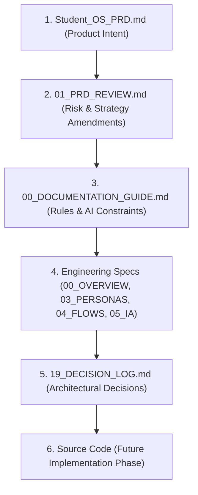

# Documentation Guide — Student Academic OS

**Document ID:** `00_DOCUMENTATION_GUIDE`  
**Author:** Principal Software Architect  
**Status:** Approved / Frozen Under Architecture Freeze  
**Primary References:** [Student_OS_PRD.md](file:///c:/Users/vishv/OneDrive/Desktop/Student-Academic-OS/docs/Student_OS_PRD.md), [01_PRD_REVIEW.md](file:///c:/Users/vishv/OneDrive/Desktop/Student-Academic-OS/docs/01_PRD_REVIEW.md)  
**Target Audience:** Core Engineering Team, Technical Leadership, AI Implementation Agents  

---

## 1. Purpose of Engineering Documentation

This document serves as the supreme governance framework for all software engineering, architecture, and technical specification documents within the **Student Academic OS** project.

Student Academic OS is designed as a single-user, offline-first personal academic ERP built to operate continuously for four years (2025–2029) without structural degradation, data loss, or recurring financial cost. Because the system will be maintained and extended across an extended academic timeline—frequently by AI engineering agents working asynchronously—the engineering documentation must maintain absolute precision, internal consistency, and technical rigor.

The primary goals of this documentation architecture are:
1. **Long-Term Maintainability:** Ensure any engineer or AI agent can inspect, maintain, and extend the system without relying on implicit knowledge or unwritten assumptions.
2. **Implementation Readiness:** Provide exhaustive, unambiguous specifications that eliminate guesswork during implementation phases.
3. **Traceability:** Maintain explicit links between product requirements ([Student_OS_PRD.md](file:///c:/Users/vishv/OneDrive/Desktop/Student-Academic-OS/docs/Student_OS_PRD.md)), architectural reviews ([01_PRD_REVIEW.md](file:///c:/Users/vishv/OneDrive/Desktop/Student-Academic-OS/docs/01_PRD_REVIEW.md)), technical design documents, and decision records.
4. **Architectural Governance:** Enforce design boundaries, security stances (e.g., Tailscale mesh isolation), and data integrity rules (e.g., soft-delete everywhere, Dexie.js offline schema mirror).

---

## 2. Documentation Structure & Directory Layout

All project documentation resides exclusively under the `/docs` directory. The structure uses standardized numerical prefixes to establish a logical reading hierarchy:

```
/docs
├── Student_OS_PRD.md             [IMMUTABLE] Product Requirements Document (Source of Truth)
├── 01_PRD_REVIEW.md              [IMMUTABLE] PRD Review & Architectural Risk Analysis
├── 00_DOCUMENTATION_GUIDE.md     [ACTIVE] Documentation Governance & AI Rules (This File)
├── 00_PROJECT_OVERVIEW.md        [ACTIVE] System Context, Vision, Principles & Tech Stack
├── 03_USER_PERSONAS.md           [ACTIVE] Student Persona, Workflows, & Behavioral Constraints
├── 04_USER_FLOWS.md              [ACTIVE] Exhaustive End-to-End Sequence & State Workflows
├── 05_INFORMATION_ARCHITECTURE.md[ACTIVE] Screen Hierarchy, Navigation Tree, & Routing Specs
├── DOCUMENTATION_AUDIT.md        [ACTIVE] Phase Readiness Audit & Consistency Verification
├── 19_DECISION_LOG.md            [FUTURE] Architecture & Design Decision Records (ADRs)
└── 21_OPEN_QUESTIONS.md          [FUTURE] Unresolved Engineering & Product Inquiries
```

---

## 3. Naming Conventions & File Standards

### 3.1 File Naming Format
- **Directory Location:** All documentation MUST be saved inside `/docs/`.
- **Numerical Prefix:** Mandatory two-digit prefix matching the category (e.g., `00_` for Meta/Overview, `03_` for Product/UX, `04_` for Flows, `05_` for Architecture, `19_` for Logs, `21_` for Inquiries).
- **Casing:** UPPERCASE ASCII letters with underscores (`_`) separating words. Example: `00_PROJECT_OVERVIEW.md`.
- **Extension:** Standard GitHub-Flavored Markdown (`.md`).

### 3.2 Code Asset & Identifier Naming
When referencing code constructs inside documentation:
- **Files & Directories:** `lowercase_snake_case` or `kebab-case` (e.g., `attendance_service.ts`, `dexie-store.ts`).
- **Database Tables & Entities:** `PascalCase` singular for entities in specs, `snake_case` or `camelCase` for SQL/Dexie schemas (e.g., `LectureSlot`, `AttendanceRecord`).
- **REST Endpoints:** `lowercase-kebab-case` (e.g., `/api/lecture-slots`, `/api/attendance/bulk-mark`).
- **Functions & Variables:** `camelCase` (e.g., `calculateSafeToSkip()`, `activeSemesterId`).

---

## 4. Source of Truth Policy & Hierarchy

To prevent conflicting requirements, all engineers and AI agents MUST respect the following strict hierarchy of authority:



### Hierarchy Rules:
1. **[Student_OS_PRD.md](file:///c:/Users/vishv/OneDrive/Desktop/Student-Academic-OS/docs/Student_OS_PRD.md)** is the supreme authority for product intent, features, scope, and user requirements.
2. **[01_PRD_REVIEW.md](file:///c:/Users/vishv/OneDrive/Desktop/Student-Academic-OS/docs/01_PRD_REVIEW.md)** modifies technical strategy (e.g., replacing public PIN endpoints with Tailscale mesh networks, mandating off-site GitHub backup, requiring 2-device conflict queues).
3. If an engineering specification conflicts with `Student_OS_PRD.md` or `01_PRD_REVIEW.md`, **the PRD documents take precedence**, and the inconsistency MUST be logged in `21_OPEN_QUESTIONS.md`.

---

## 5. Document Ownership & Immutability Rules

### 5.1 Immutable Documents
The following documents are **FROZEN & IMMUTABLE**:
- [Student_OS_PRD.md](file:///c:/Users/vishv/OneDrive/Desktop/Student-Academic-OS/docs/Student_OS_PRD.md)
- [01_PRD_REVIEW.md](file:///c:/Users/vishv/OneDrive/Desktop/Student-Academic-OS/docs/01_PRD_REVIEW.md)

**STRICT RULE:** No developer, agent, or automated script may edit, truncate, rewrite, or overwrite these files under any circumstances. They represent approved product sign-offs.

### 5.2 Modifying & Extending Specifications
- Functional additions or clarifications MUST be documented in new or existing numbered engineering specs (e.g., `04_USER_FLOWS.md`, `05_INFORMATION_ARCHITECTURE.md`).
- Technical architectural changes MUST be recorded as an ADR entry in `19_DECISION_LOG.md`.

---

## 6. Architecture Freeze Policy

The project is currently under a strict **Architecture Freeze**.

### 6.1 Prohibited Actions:
During the Architecture Freeze, the following activities are **STRICTLY FORBIDDEN**:
- Creating source code files (`.ts`, `.tsx`, `.js`, `.py`, `.sql`, etc.).
- Initializing or scaffolding application folders (`src/`, `server/`, `components/`).
- Generating React components or state hooks.
- Writing backend Express controllers, routes, or middleware.
- Writing SQL DDL/DML migrations or Prisma/Kysely schemas.
- Installing npm packages, `node_modules`, or lockfiles (`package-lock.json`).
- Configuring CI/CD pipelines, Dockerfiles, or infrastructure scripts.
- Creating test suites or mock implementations.

### 6.2 Allowed Actions:
- Analyzing existing documentation.
- Drafting and refining markdown technical specifications inside `/docs`.
- Constructing visual architecture diagrams (Mermaid format).
- Documenting user flows, data structures, and state transitions.
- Recording open questions, edge cases, and risk mitigation strategies.

---

## 7. Cross-Reference Rules & Hyperlinking

All engineering documents MUST be tightly cross-referenced using valid Markdown file links (`file:///...` format or relative repository links).

### Rules for Links:
1. Every new document MUST explicitly link back to `Student_OS_PRD.md` and `01_PRD_REVIEW.md` in its header metadata and relevant sections.
2. Link text MUST be descriptive (e.g., `[Student_OS_PRD.md §14](file:///c:/Users/vishv/OneDrive/Desktop/Student-Academic-OS/docs/Student_OS_PRD.md#14-attendance-system)`).
3. Do NOT surround link text with backticks (e.g., write `[Student_OS_PRD.md](...)`, NOT [`Student_OS_PRD.md`](...)).
4. When citing specific sections, include section numbers or headings.

---

## 8. AI Agent Rules & Guidance

Future AI coding agents operating on this repository MUST strictly follow these execution constraints:

1. **Read Before Writing:** AI agents MUST inspect `00_DOCUMENTATION_GUIDE.md`, `Student_OS_PRD.md`, `01_PRD_REVIEW.md`, and all related numbered specs before executing tasks.
2. **Offline-First Non-Negotiable:** Never introduce cloud-only dependencies that break offline execution. All core entities (`Semester`, `Subject`, `LectureSlot`, `AttendanceRecord`, `Note`, `Task`, `Exam`) MUST exist and mutate in client-side IndexedDB (Dexie.js) first.
3. **Soft Delete Mandatory:** Never issue `DELETE` SQL queries or Dexie `.delete()` calls on domain entities. All deletions MUST be soft-deletes via `isDeleted = true` / `deletedAt = timestamp`.
4. **Tailscale Network Isolation:** Backend endpoints MUST NOT be exposed directly to the public internet without Tailscale mesh authentication.
5. **Quiet Dashboard Rule:** Never render warning alerts or banners on the UI unless a threshold condition is explicitly breached (e.g., attendance < 75%).
6. **No Placeholder Code:** In implementation phases, placeholder comments (e.g., `// TODO: implement later`) in core logic (attendance math, sync reconciliation, soft delete) are forbidden.

---

## 9. Review Workflow & Decision Recording

### 9.1 Technical Review Process
Before any specification is marked as `Approved`:
1. **Completeness Check:** Does it address all failure modes and edge cases identified in [01_PRD_REVIEW.md](file:///c:/Users/vishv/OneDrive/Desktop/Student-Academic-OS/docs/01_PRD_REVIEW.md)?
2. **Data Model Validation:** Are entity attributes compatible with Dexie.js (IndexedDB) and Neon Postgres?
3. **Cross-Doc Consistency:** Are route paths, table names, and user terminology consistent across `03_USER_PERSONAS.md`, `04_USER_FLOWS.md`, and `05_INFORMATION_ARCHITECTURE.md`?

### 9.2 Architecture Decision Log (ADR Format)
When architectural trade-offs occur during implementation, they MUST be logged in `19_DECISION_LOG.md` using the following structure:
```markdown
### ADR-XXX: [Short Title]
- **Status:** [Proposed | Accepted | Superseded]
- **Date:** YYYY-MM-DD
- **Context:** [Why was this decision necessary?]
- **Decision:** [What technical choice was made?]
- **Consequences:** [Positive, negative, and risk implications]
- **PRD Reference:** [Link to PRD section]
```

---

## 10. Future Documentation Standards

As the project progresses into future phases, documentation must evolve without degrading existing specs:
- **Phase 1–3 (Local & Sync):** Expand `/docs` with detailed schema definitions (`06_DATABASE_SCHEMA.md`), API specs (`07_API_SPECIFICATION.md`), and sync protocol specifications (`08_SYNC_PROTOCOL.md`).
- **Phase 4–6 (Notifications & Polish):** Document push notification payload schemas and analytics aggregation jobs.
- **Phase 7+ (AI & Automation):** Maintain append-only event log schemas (`AnalyticsEvent`) for LLM query parsing and revision planner integration.
