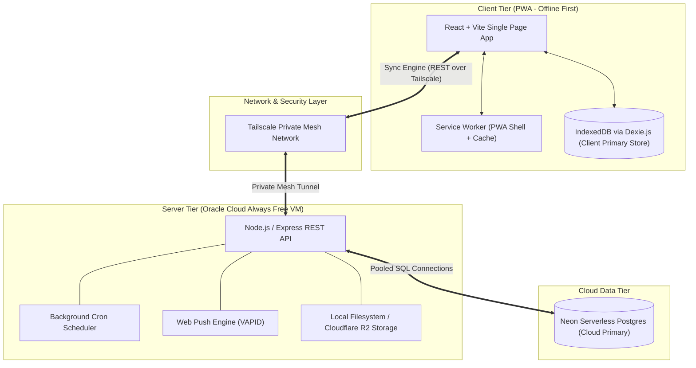

# Project Overview — Student Academic OS

**Document ID:** `00_PROJECT_OVERVIEW`  
**Author:** Principal Software Architect  
**Status:** Approved / Frozen Under Architecture Freeze  
**Primary References:** [Student_OS_PRD.md](file:///c:/Users/vishv/OneDrive/Desktop/Student-Academic-OS/docs/Student_OS_PRD.md), [01_PRD_REVIEW.md](file:///c:/Users/vishv/OneDrive/Desktop/Student-Academic-OS/docs/01_PRD_REVIEW.md)  
**Target Audience:** Engineering Leadership, System Architects, Core Developers, AI Implementation Agents  

---

## 1. Executive Summary

**Student Academic OS** is an offline-first, self-hosted, zero-recurring-cost personal academic Enterprise Resource Planning (ERP) and "second brain" platform. Built specifically for Vishvraj Solanki (B.Tech AI & Data Science, ADIT / CVM University, Batch 2025–2029), the application is designed to operate seamlessly across a 4-year undergraduate lifecycle without requiring ongoing maintenance, paid cloud subscriptions, or active internet connectivity during daily academic use.

The system integrates four distinct academic operational pillars—**Live Attendance Math**, **Dynamic Timetable Management**, **Markdown & Multi-Modal Note Organization**, and **Task/Exam Countdown Tracking**—into a single unified, ultra-responsive Progressive Web Application (PWA).

```
                      STUDENT ACADEMIC OS — CORE PILLARS
┌───────────────────────┬───────────────────────┬───────────────────────┬───────────────────────┐
│   ATTENDANCE MATH     │   DYNAMIC TIMETABLE   │      NOTES ENGINE     │     TASK & EXAMS      │
│ • 5-State Tracking    │ • Weekly/Daily Views  │ • Markdown First      │ • Task Dependencies   │
│ • 75% Rule Engine     │ • Exam Overlay        │ • Multi-modal Attach. │ • Syllabus Checklists │
│ • Safe-to-Skip Calc   │ • Room/Faculty Swap  │ • Global Search       │ • Push Countdowns     │
└───────────────────────┴───────────────────────┴───────────────────────┴───────────────────────┘
```

---

## 2. Vision & Purpose

### 2.1 Problem Statement
Modern undergraduate students face continuous cognitive overload caused by fragmented digital systems:
- **Mental Attendance Math:** Constantly recalculating whether skipping a lecture will violate CVM University's mandatory 75% attendance threshold.
- **Schedule Disruption:** Tracking verbal or unannounced room, faculty, and slot changes announced during lectures.
- **Scattered Knowledge Assets:** Notes, PDFs, assignments, and announcements dispersed across WhatsApp groups, physical notebooks, and phone screenshot galleries.
- **Deadline Anxiety:** Managing overlapping assignments, lab submissions, and mid-semester exam dates across un-synchronized tools.
- **Historical Data Erosion:** Losing lower-semester performance metrics, past notes, and faculty contact records upon advancing to higher semesters.

### 2.2 System Vision
Student Academic OS replaces these fragmented tools with an autonomous personal operating system shaped precisely around ADIT's timetable structure, CVM's attendance rules, and long-term academic tracking. It acts as an authoritative, private academic vault that guarantees **zero data loss over four years**, operates 100% offline in lecture halls, and surfaces vital answers in under **three seconds**.

---

## 3. High-Level Goals & Non-Goals

### 3.1 Core Goals
1. **Instant Clarity (<3 Seconds):** Opening the app immediately surfaces: *What class is next?*, *Am I at attendance risk?*, and *What task is due today?*
2. **Offline Supremacy:** 100% of daily actions (marking attendance, taking notes, creating tasks) function without network access using local IndexedDB (Dexie.js).
3. **Zero Financial Overhead:** Operates permanently on free-tier infrastructure (Oracle Cloud Always Free VM, Neon Serverless Postgres free tier, Cloudflare R2 / local storage, GitHub Student Pack Sentry).
4. **4-Year Data Integrity:** Soft-delete policy everywhere ensuring no historical record is ever permanently destroyed.

### 3.2 Non-Goals (Out of Scope for Phase 1–6)
- **Multi-Tenant SaaS:** System is strictly architected for single-user execution.
- **Public API Exposure:** System will not expose public REST APIs to the open web; network transport is isolated within a private Tailscale mesh network ([01_PRD_REVIEW.md §Security Concerns](file:///c:/Users/vishv/OneDrive/Desktop/Student-Academic-OS/docs/01_PRD_REVIEW.md#security-concerns)).
- **Paid Heavy Cloud Services:** No paid AWS/GCP/Azure dependencies.

---

## 4. Confirmed Technology Stack

The engineering stack is strictly locked based on [Student_OS_PRD.md §4](file:///c:/Users/vishv/OneDrive/Desktop/Student-Academic-OS/docs/Student_OS_PRD.md#4-stack-confirmed) and architectural refinements from [01_PRD_REVIEW.md](file:///c:/Users/vishv/OneDrive/Desktop/Student-Academic-OS/docs/01_PRD_REVIEW.md):



### Stack Components Breakdown:

| Layer | Technology | Primary Function | Justification / PRD Reference |
| :--- | :--- | :--- | :--- |
| **Frontend Framework** | React + Vite | UI Component Rendering & SPA Routing | Lightning fast build, zero overhead, PWA compatible ([Student_OS_PRD.md §4](file:///c:/Users/vishv/OneDrive/Desktop/Student-Academic-OS/docs/Student_OS_PRD.md#4-stack-confirmed)) |
| **Local Database** | IndexedDB (Dexie.js) | Primary Client Data Store & Cache | Enables 100% offline reads/writes with reactive UI hooks |
| **Application Shell** | Service Worker + Web App Manifest | PWA Lifecycle & Asset Caching | Versioned cache management, installable on mobile/desktop |
| **Backend Runtime** | Node.js + Express | Sync API, Cron Scheduler, Push Worker | Lightweight execution on Oracle Always Free VM |
| **Cloud Database** | Neon Postgres | Primary Remote Database | Serverless Postgres free tier, automatic sleep/wake handling |
| **Security Layer** | Tailscale Private Mesh Network | API Network Isolation | Eliminates public API attack surface & SSL cert renewals ([01_PRD_REVIEW.md §Security](file:///c:/Users/vishv/OneDrive/Desktop/Student-Academic-OS/docs/01_PRD_REVIEW.md#security-concerns)) |
| **Push Notifications** | Web Push API (VAPID) | Cross-Platform Reminders & Risk Banners | Zero-cost native background push alerts without third-party SaaS |
| **Attachment Storage** | Local VM Disk / Cloudflare R2 | PDF, Images & Note File Attachments | Keeps Postgres DB lightweight; 10GB free object storage ([01_PRD_REVIEW.md §Scalability](file:///c:/Users/vishv/OneDrive/Desktop/Student-Academic-OS/docs/01_PRD_REVIEW.md#scalability-concerns)) |
| **Off-Site Backup** | Private GitHub Repository | Automated External JSON Archive | Protects against Oracle VM reclamation or disk failure ([01_PRD_REVIEW.md §Weakness #2](file:///c:/Users/vishv/OneDrive/Desktop/Student-Academic-OS/docs/01_PRD_REVIEW.md#weaknesses)) |
| **Error Monitoring** | Sentry Free Tier | Client/Server Crash Logging | GitHub Student Developer Pack entitlement |

---

## 5. System Principles & Engineering Philosophy

### 5.1 Offline-First Baseline
The application treats the network as an asynchronous enhancement, not a prerequisite. All user actions mutate local IndexedDB state immediately. Background sync reconciliation handles cloud persistence when a Tailscale connection to the backend is active.

### 5.2 The "Quiet Dashboard" Philosophy
As specified in [Student_OS_PRD.md §12](file:///c:/Users/vishv/OneDrive/Desktop/Student-Academic-OS/docs/Student_OS_PRD.md#12-dashboard-design), the Dashboard is designed to be quiet and calm when academic status is healthy. Attendance risk banners and warning indicators render **only when a subject drops below the 75% target threshold**. An always-green dashboard that stays silent builds user trust.

### 5.3 Soft-Delete Everywhere & Historical Immutability
No data row in Student Academic OS is ever subjected to a hard `DELETE`. All tables include `isDeleted: boolean` and `deletedAt: timestamp` fields. Past semester timetables, archived subjects, and historical faculty assignments remain queryable forever ([Student_OS_PRD.md §23](file:///c:/Users/vishv/OneDrive/Desktop/Student-Academic-OS/docs/Student_OS_PRD.md#23-database-architecture)).

### 5.4 Partitioned Data Growth (4-Year Performance)
To guarantee that year-4 performance matches year-1 speed, data queries on the client default to active semester partitions (`Semester.isActive = true`). Historical semesters are moved to the `Semester Archive` module and loaded lazily on demand ([01_PRD_REVIEW.md §Scalability](file:///c:/Users/vishv/OneDrive/Desktop/Student-Academic-OS/docs/01_PRD_REVIEW.md#scalability-concerns)).

---

## 6. Success Metrics & Quality Targets

| Metric Area | Target Requirement | Verification Mechanism |
| :--- | :--- | :--- |
| **Time-to-Insight** | < 3 seconds from app launch to Next Class / Risk view | Client performance timers on Dashboard load |
| **Offline Operation** | 100% functional read/write for local data | Execution in airplane mode with zero network |
| **Data Retention** | 0 lost attendance marks, notes, or tasks over 4 years | Soft-delete architecture & dual client/cloud backups |
| **Operational Cost** | $0.00 / month across all 4 years | Utilization of Oracle Free VM, Neon Free, Tailscale Free |
| **Attendance Precision** | Exact 75% threshold calculation excluding cancelled lectures | Unit tests on `attended / (scheduled - cancelled)` formula |
| **Sync Safety** | 0 silent data overwrites during 2-device offline edits | Conflict queue prompt implementation ([01_PRD_REVIEW.md §Sync Concerns](file:///c:/Users/vishv/OneDrive/Desktop/Student-Academic-OS/docs/01_PRD_REVIEW.md#sync-concerns)) |

---

## 7. Project Constraints & Architectural Risks

### 7.1 Infrastructure Resilience & Oracle Reclamation Risk
As documented in [01_PRD_REVIEW.md §Risks](file:///c:/Users/vishv/OneDrive/Desktop/Student-Academic-OS/docs/01_PRD_REVIEW.md#risks), Oracle Cloud reserves the right to reclaim inactive "Always Free" VMs. 
- **Mitigation:** A scheduled background cron ping maintains compute activity. Automated nightly JSON data dumps push to a private GitHub repository, allowing complete restoration onto an alternative host (e.g., Fly.io or home server) within 15 minutes.

### 7.2 Two-Device Synchronization Collisions
When phone and laptop are used offline simultaneously in different lectures, merging `AttendanceRecord` mutations using naive Last-Write-Wins (LWW) causes silent data loss ([01_PRD_REVIEW.md §Weakness #1](file:///c:/Users/vishv/OneDrive/Desktop/Student-Academic-OS/docs/01_PRD_REVIEW.md#weaknesses)).
- **Mitigation:** High-stakes entities (`AttendanceRecord`, `LectureSlot` status) use an explicit multi-device Conflict Resolution Queue, prompting the user to resolve conflicting marks upon reconnection.
