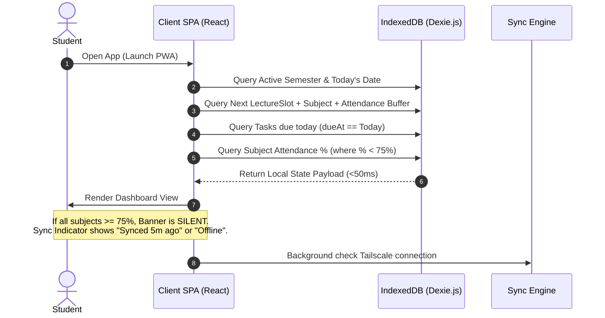
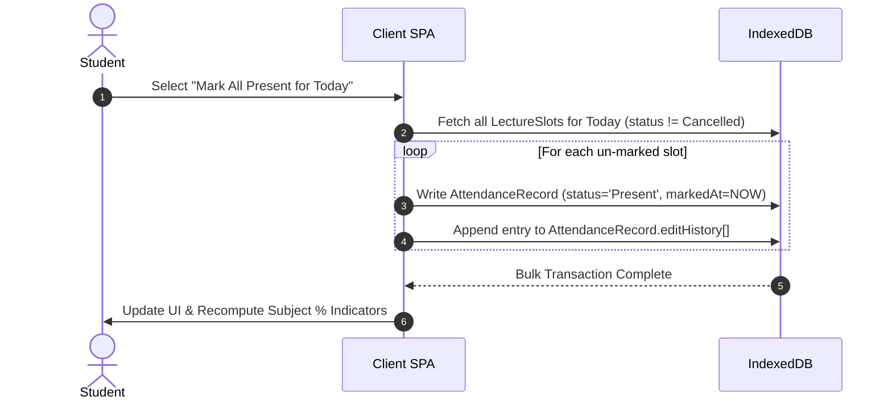
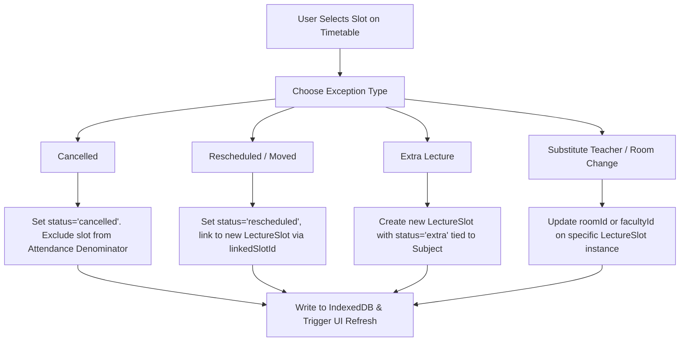
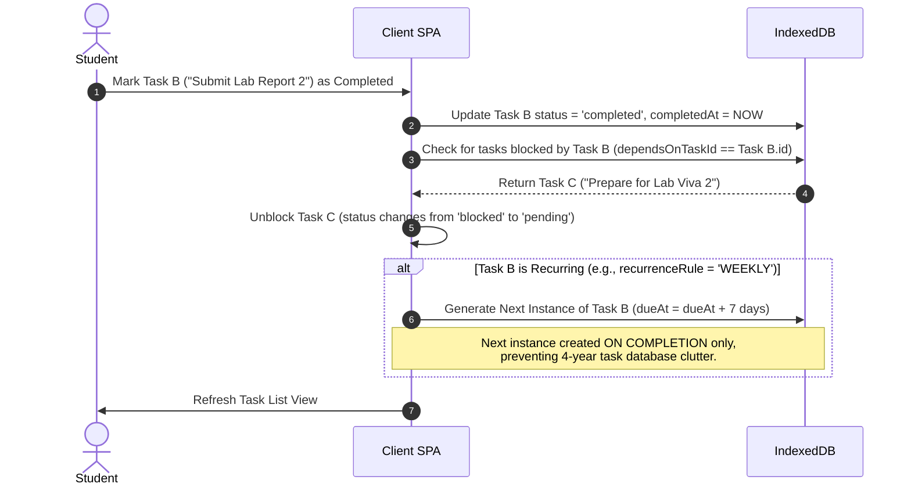
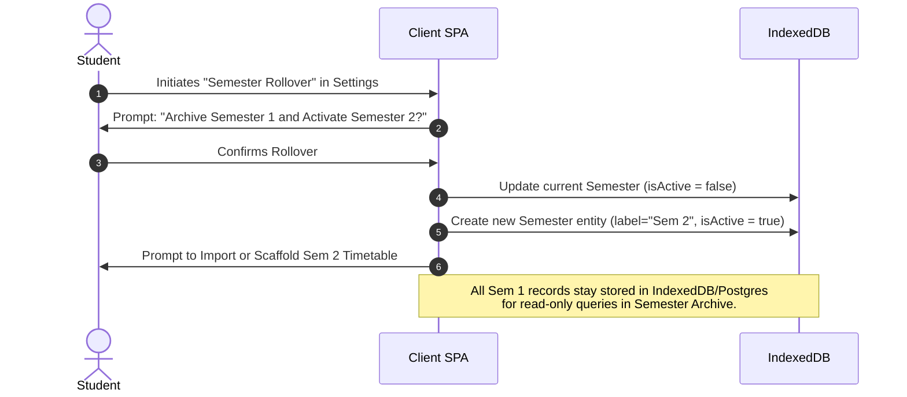
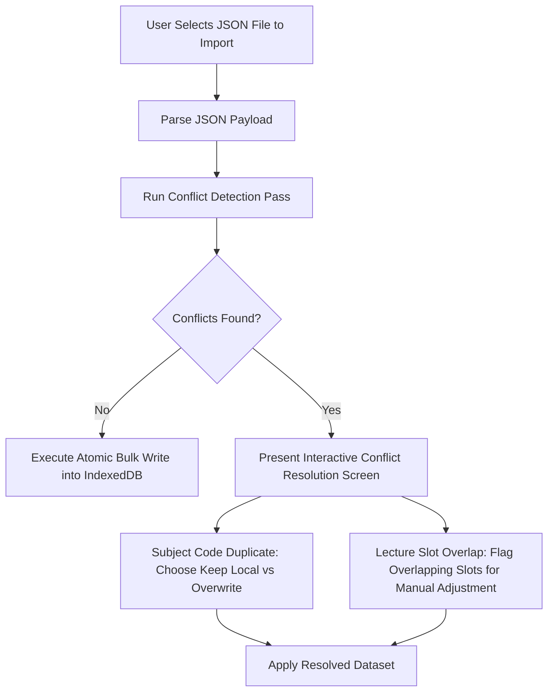
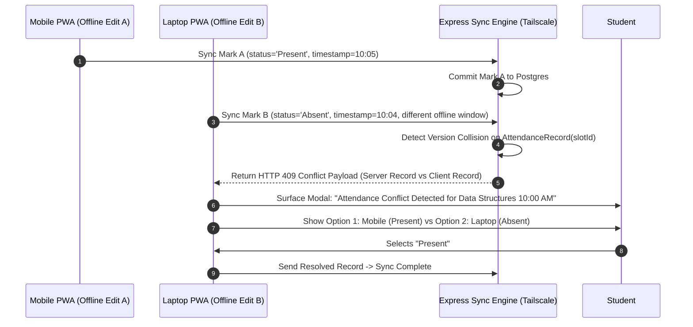

# User Flows & Sequence Specifications — Student Academic OS

**Document ID:** `04_USER_FLOWS`  
**Author:** Principal Software Architect  
**Status:** Approved / Frozen Under Architecture Freeze  
**Primary References:** [Student_OS_PRD.md §6, §8, §14-§20, §24, §26](file:///c:/Users/vishv/OneDrive/Desktop/Student-Academic-OS/docs/Student_OS_PRD.md), [01_PRD_REVIEW.md §Missing User Flows, §Weakness #1, §Weakness #5](file:///c:/Users/vishv/OneDrive/Desktop/Student-Academic-OS/docs/01_PRD_REVIEW.md)  
**Target Audience:** UX Engineers, Frontend Developers, Backend Engineers, QA Testers, AI Implementation Agents  

---

## 1. Overview & Execution Standards

This document specifies every primary, secondary, and edge-case user flow within **Student Academic OS**. 

To maintain compliance with the system's **Offline-First Architectural Directive**, every flow is specified with dual-state mechanics:
1. **Immediate Local Mutation:** State updates written to IndexedDB via Dexie.js with zero network dependency.
2. **Asynchronous Background Sync:** Reconciliation with Neon Postgres over the private Tailscale mesh network.

---

## 2. Comprehensive Flow Index

1. [Flow 01: Morning Briefing & Quiet Dashboard](#flow-01-morning-briefing--quiet-dashboard)
2. [Flow 02: Single-Slot 5-State Attendance Marking](#flow-02-single-slot-5-state-attendance-marking)
3. [Flow 03: Bulk Attendance Marking & Backfill with Audit Trail](#flow-03-bulk-attendance-marking--backfill-with-audit-trail)
4. [Flow 04: Lecture Exceptions (Extra, Cancelled, Rescheduled, Substitute Teacher)](#flow-04-lecture-exceptions-extra-cancelled-rescheduled-substitute-teacher)
5. [Flow 05: Mid-Semester Teacher & Room Directory Overrides](#flow-05-mid-semester-teacher--room-directory-overrides)
6. [Flow 06: Task Lifecycle, Dependencies & Auto-Recurrence](#flow-06-task-lifecycle-dependencies--auto-recurrence)
7. [Flow 07: Notes Engine, Multi-Modal Quick Capture & Voice (Wispr Flow)](#flow-07-notes-engine-multi-modal-quick-capture--voice-wispr-flow)
8. [Flow 08: Exam Preparation, Syllabus Sweeping & Revision Planning](#flow-08-exam-preparation-syllabus-sweeping--revision-planning)
9. [Flow 09: Semester Rollover, Archiving & Timetable Activation](#flow-09-semester-rollover-archiving--timetable-activation)
10. [Flow 10: JSON Import/Export with Conflict Resolution](#flow-10-json-importexport-with-conflict-resolution)
11. [Flow 11: Two-Device Offline Edit Conflict Queue](#flow-11-two-device-offline-edit-conflict-queue)
12. [Flow 12: Offline Mode, Auto-Reconnection & Sync Health Indicator](#flow-12-offline-mode-auto-reconnection--sync-health-indicator)
13. [Flow 13: Push Notification Pipeline & Revocation Recovery](#flow-13-push-notification-pipeline--revocation-recovery)
14. [Flow 14: Global Command Palette Search (Cmd+K)](#flow-14-global-command-palette-search-cmdk)
15. [Flow 15: VM Downtime Detection & Email Failover Alerting](#flow-15-vm-downtime-detection--email-failover-alerting)
16. [Flow 16: Off-Site Private GitHub Automated Data Backup](#flow-16-off-site-private-github-automated-data-backup)

---

## 3. Detailed User Flow Specifications

### Flow 01: Morning Briefing & Quiet Dashboard

- **Goal:** Surface immediate academic priorities (Next Class, Attendance Risks, Tasks Due) in under 3 seconds upon app launch.
- **Triggers:** User launches PWA on mobile or desktop during morning routine.
- **Preconditions:** App is installed; active semester is configured (`Semester.isActive = true`).



#### State & Response Matrix:
| Step | User Action | System UI Response | Local IndexedDB Mutation |
| :--- | :--- | :--- | :--- |
| 1 | Launches app | Displays skeleton layout (<100ms) | Read `Semester`, `LectureSlot`, `AttendanceRecord` |
| 2 | Views Dashboard | Renders: 1. Next Class Card, 2. Today Slots Strip, 3. Risk Banner (conditional), 4. Due Tasks | None (Read-only query) |
| 3 | Observes Sync Status | Persistent header badge shows green dot ("Synced") or orange dot ("Offline") | Read `SyncState` metadata table |

---

### Flow 02: Single-Slot 5-State Attendance Marking

- **Goal:** Record attendance for a scheduled lecture slot using one of 5 recognized states (`Present`, `Absent`, `Late`, `Medical`, `On-Duty`).
- **Triggers:** Lecture finishes, or user responds to post-class notification prompt.
- **Preconditions:** `LectureSlot` exists in the local schedule; slot date is `<= today`.

```mermaid
flowchart TD
    A[User Selects Lecture Slot] --> B{Is Slot Date in Future?}
    B -- Yes --> C[Display Error: Future Marking Blocked]
    B -- No --> D[Present 5-State Selector Sheet]
    D --> E[User Selects: Present | Absent | Late | Medical | On-Duty]
    E --> F[Update Local IndexedDB AttendanceRecord]
    F --> G[Recalculate Subject Attendance % & Safe-to-Skip Count]
    G --> H[Update Dashboard UI Instantly]
    H --> I[Queue Entity for Asynchronous Sync over Tailscale]
```

#### Mathematical Logic ([Student_OS_PRD.md §14](file:///c:/Users/vishv/OneDrive/Desktop/Student-Academic-OS/docs/Student_OS_PRD.md#14-attendance-system)):
- **Denominator Rule:** `Scheduled Lectures - Cancelled Lectures`
- **Numerator Rule:** `Present + Late + Medical + On-Duty` (weighted per policy; default 1.0)
- **Safe-To-Skip Math:** Solves for max future absences $X$ such that:
$$\frac{\text{Attended}}{\text{Scheduled} - \text{Cancelled} + X} \ge 0.75$$

---

### Flow 03: Bulk Attendance Marking & Backfill with Audit Trail

- **Goal:** Allow user to mark all classes for an entire day at once or backfill forgotten past dates without corrupting historical records.
- **Triggers:** User opens Attendance Center -> "Bulk Mark Day" or "Backfill History".
- **Preconditions:** Slot dates are within active semester bounds and $\le$ today.



#### Audit Trail Rule:
When editing a previously marked record, the system MUST NOT overwrite `markedAt`. It appends the change to `editHistory: [{ previousStatus, newStatus, editedAt, reason }]`.

---

### Flow 04: Lecture Exceptions (Extra, Cancelled, Rescheduled, Substitute Teacher)

- **Goal:** Handle real-world timetable deviations without deleting or distorting the underlying weekly schedule pattern.
- **Triggers:** Announcement made in class regarding cancellation, room change, or extra lecture.



---

### Flow 05: Mid-Semester Teacher & Room Directory Overrides

- **Goal:** Maintain an accurate record of faculty contacts, office hours, and cabin locations even if teachers change mid-semester.
- **Triggers:** Faculty replacement assigned mid-semester or office hours updated.
- **Flow Details:**
  1. User opens Directory -> Selects Subject -> Taps "Change Faculty".
  2. System prompts for new Teacher selection or creation.
  3. System appends previous faculty to `Subject.facultyHistory: [{ teacherId, startDate, endDate }]`.
  4. System updates `Subject.currentFacultyId` to new teacher.

---

### Flow 06: Task Lifecycle, Dependencies & Auto-Recurrence

- **Goal:** Manage academic tasks with subject tagging, subtask checklists, dependency blocking, and non-cluttering auto-recurrence.
- **Triggers:** Assignment assigned, lab report created, or recurring study task completed.



---

### Flow 07: Notes Engine, Multi-Modal Quick Capture & Voice (Wispr Flow)

- **Goal:** Capture lecture notes via Markdown, images, PDFs, or voice input; link notes to subjects and lecture dates.
- **Triggers:** User taps Quick Capture FAB or opens Notes module.

```mermaid
flowchart TD
    A[User Taps Quick Capture FAB] --> B{Select Input Mode}
    B --> C1[Markdown Text]
    B --> C2[Voice Capture via Wispr Flow]
    B --> C3[File / Photo Attachment]

    C1 --> D1[Open Inline Editor with Subject & Slot pre-linked]
    C2 --> D2[Record Audio -> Wispr Flow API / Client Web Audio -> Transcribe to Markdown]
    C3 --> D3[Store attachment in Local FS / Cloudflare R2 -> Store fileRef in Note entity]

    D1 & D2 & D3 --> E[Save Note to IndexedDB with isDeleted=false]
    E --> F[Update Client Full-Text Search Index (MiniSearch)]
```

---

### Flow 08: Exam Preparation, Syllabus Sweeping & Revision Planning

- **Goal:** Prepare for upcoming exams by tracking syllabus checklists and linked notes.
- **Triggers:** Exam entry added or exam date approaches (7-day, 1-day push countdowns).
- **Flow Details:**
  1. User opens Exam module -> Selects Exam.
  2. System presents:
     - Days remaining countdown.
     - Interactive Syllabus Checklist (% covered).
     - Filtered list of Notes tagged with `#subject-code` and `#exam-important`.
  3. Free-Time Finder algorithm scans timetable gaps to suggest revision time blocks.

---

### Flow 09: Semester Rollover, Archiving & Timetable Activation

- **Goal:** Transition from Semester $N$ to Semester $N+1$ without deleting historical data or degrading database performance ([01_PRD_REVIEW.md §Missing User Flows](file:///c:/Users/vishv/OneDrive/Desktop/Student-Academic-OS/docs/01_PRD_REVIEW.md#missing-user-flows)).



---

### Flow 10: JSON Import/Export with Conflict Resolution

- **Goal:** Export complete academic database or import new semester timetable JSON without silent overwrites ([Student_OS_PRD.md §26](file:///c:/Users/vishv/OneDrive/Desktop/Student-Academic-OS/docs/Student_OS_PRD.md#26-import--export)).
- **Conflict Resolution Matrix:**



---

### Flow 11: Two-Device Offline Edit Conflict Queue

- **Goal:** Prevent silent data loss when phone and laptop edit the same `AttendanceRecord` or `LectureSlot` offline ([01_PRD_REVIEW.md §Weakness #1](file:///c:/Users/vishv/OneDrive/Desktop/Student-Academic-OS/docs/01_PRD_REVIEW.md#weaknesses)).



---

### Flow 12: Offline Mode, Auto-Reconnection & Sync Health Indicator

- **Goal:** Provide explicit sync transparency without disrupting quiet dashboard aesthetics ([01_PRD_REVIEW.md §UX Concerns](file:///c:/Users/vishv/OneDrive/Desktop/Student-Academic-OS/docs/01_PRD_REVIEW.md#ux-concerns)).

```
┌─────────────────────────────────────────────────────────────────────────────────┐
│ HEADER SYNC BADGE STATES:                                                       │
│ [🟢 Synced 2m ago]   -> Connected over Tailscale, no pending mutations.          │
│ [🟠 Offline]          -> Tailscale unreachable, mutations queued in IndexedDB.   │
│ [🔴 Sync Collision]   -> 2-device conflict requires user resolution.             │
└─────────────────────────────────────────────────────────────────────────────────┘
```

---

### Flow 13: Push Notification Pipeline & Revocation Recovery

- **Goal:** Fire time-sensitive alerts (lecture reminders, exam countdowns, attendance risk warnings) and recover if push permissions are revoked by OS ([01_PRD_REVIEW.md §Missing Edge Cases](file:///c:/Users/vishv/OneDrive/Desktop/Student-Academic-OS/docs/01_PRD_REVIEW.md#missing-edge-cases)).
- **Quiet Hours Enforcement:** Notifications between **11:00 PM and 7:00 AM** are muted automatically, excluding critical exam-morning alerts.

---

### Flow 14: Global Command Palette Search (Cmd+K)

- **Goal:** Find any note, subject, teacher, room, exam, or resource instantly via unified modal.
- **Keyboard Shortcut:** `Cmd+K` (macOS) / `Ctrl+K` (Windows/Linux) or Search FAB (Mobile).
- **Engine:** Client-side MiniSearch index executing directly against local IndexedDB tables.

---

### Flow 15: VM Downtime Detection & Email Failover Alerting

- **Goal:** Notify student if Oracle Cloud VM goes down or background sync cron stops executing ([01_PRD_REVIEW.md §Weakness #3](file:///c:/Users/vishv/OneDrive/Desktop/Student-Academic-OS/docs/01_PRD_REVIEW.md#weaknesses)).
- **Mechanism:** External heartbeat service (e.g., UptimeRobot / Cronitor free tier) pings `/api/health`. If ping fails for > 15 minutes, an **Email Alert** is sent directly to Vishvraj's personal inbox (Push notification cannot be used since server is down).

---

### Flow 16: Off-Site Private GitHub Automated Data Backup

- **Goal:** Guarantee off-site backup redundancy outside Oracle Cloud VM ([01_PRD_REVIEW.md §Weakness #2](file:///c:/Users/vishv/OneDrive/Desktop/Student-Academic-OS/docs/01_PRD_REVIEW.md#weaknesses)).
- **Mechanism:** Nightly background job on VM dumps sanitized JSON state, encrypts it with AES-256, and commits/pushes the snapshot to a private GitHub repository using GitHub Student Pack tokens.
