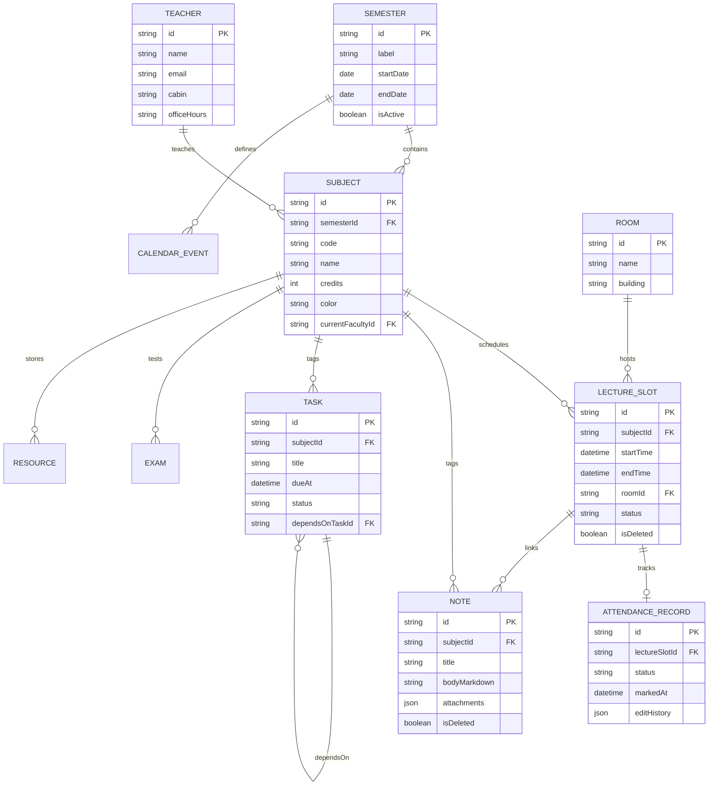

# Information Architecture & System Navigation — Student Academic OS

**Document ID:** `05_INFORMATION_ARCHITECTURE`  
**Author:** Principal Software Architect  
**Status:** Approved / Frozen Under Architecture Freeze  
**Primary References:** [Student_OS_PRD.md §9, §10, §11, §23, §27](file:///c:/Users/vishv/OneDrive/Desktop/Student-Academic-OS/docs/Student_OS_PRD.md), [01_PRD_REVIEW.md §UX Concerns, §Scalability](file:///c:/Users/vishv/OneDrive/Desktop/Student-Academic-OS/docs/01_PRD_REVIEW.md)  
**Target Audience:** UX Designers, Frontend Developers, Information Architects, AI Implementation Agents  

---

## 1. Architectural Philosophy & Navigation Strategy

The Information Architecture (IA) of **Student Academic OS** is optimized around a strict 3-second usability target:
1. **Zero Deep Nesting:** No critical daily action requires more than **two taps** from app launch.
2. **Responsive Ergonomics:** Dual navigation structures tailored for touch devices (5-tab bottom navigation bar) and desktop environments (collapsible sidebar + `Cmd+K` command palette).
3. **Quiet Surface Area:** Core views display summary data with expandable detail drawers, keeping visual density low while preserving instant access to granular audit trails.

---

## 2. Master Visual Navigation Tree

```mermaid
graph TD
    AppRoot["Student Academic OS (App Shell)"] --> NavTier["Navigation Framework"]
    
    NavTier --> MobileNav["Mobile PWA (Bottom Bar - 5 Tabs)"]
    NavTier --> DesktopNav["Desktop PWA (Left Sidebar + Cmd+K)"]

    MobileNav --> TAB1["1. Dashboard (Home)"]
    MobileNav --> TAB2["2. Timetable"]
    MobileNav --> TAB3["3. Attendance"]
    MobileNav --> TAB4["4. Notes"]
    MobileNav --> TAB5["5. More Menu"]

    TAB1 --> SCR_DASH["Dashboard View [/]"]
    
    TAB2 --> SCR_TT_WK["Weekly Grid [/timetable]"]
    TAB2 --> SCR_TT_DY["Daily Stream [/timetable/daily]"]
    TAB2 --> SCR_TT_CAL["Calendar View [/timetable/calendar]"]
    
    TAB3 --> SCR_ATT_OV["Attendance Heatmap [/attendance]"]
    TAB3 --> SCR_ATT_SUB["Subject Detail [/attendance/:subjectId]"]
    TAB3 --> SCR_ATT_LOG["Audit History Log [/attendance/audit]"]
    
    TAB4 --> SCR_NT_DIR["Folder Tree [/notes]"]
    TAB4 --> SCR_NT_EDT["Markdown Editor [/notes/:noteId]"]

    TAB5 --> SCR_TSK["Tasks Module [/tasks]"]
    TAB5 --> SCR_EXM["Exam Prep Module [/exams]"]
    TAB5 --> SCR_RES["Resources Shelf [/resources]"]
    TAB5 --> SCR_ANL["Analytics Hub [/analytics]"]
    TAB5 --> SCR_DIR["Teachers & Rooms Directory [/directory]"]
    TAB5 --> SCR_ARC["Semester Archive [/archive]"]
    TAB5 --> SCR_SET["Settings & Sync [/settings]"]
```



---

## 3. Responsive Navigation & Routing Philosophy

### 3.1 Mobile PWA Navigation (Bottom Bar)
To prevent thumb-reach crowding over 4 years of feature additions, the mobile bottom navigation bar is locked to **five primary icons** ([Student_OS_PRD.md §11](file:///c:/Users/vishv/OneDrive/Desktop/Student-Academic-OS/docs/Student_OS_PRD.md#11-navigation)):

```
┌───────────────┬───────────────┬───────────────┬───────────────┬───────────────┐
│  [🏠 Home]    │  [📅 Schedule]│  [📊 Percent] │  [📝 Notes]   │  [⚙️ More]    │
│  Dashboard    │   Timetable   │  Attendance   │  Notes Engine │  Secondary    │
└───────────────┴───────────────┴───────────────┴───────────────┴───────────────┘
```

### 3.2 Desktop PWA Navigation (Sidebar + Command Palette)
- **Left Collapsible Sidebar:** Displays all modules directly (Dashboard, Timetable, Attendance, Notes, Tasks, Exams, Resources, Analytics, Directory, Archive, Settings).
- **Command Palette (`Cmd+K` / `Ctrl+K`):** Global modal overlay providing instantaneous fuzzy search and direct keyboard route jumping across all system entities.

---

## 4. Screen-by-Screen Breakdown & UI Layout Hierarchy

### Screen 01: Dashboard (`/`) — Home View
- **Purpose:** Provide instant academic situational awareness ([Student_OS_PRD.md §10, §12](file:///c:/Users/vishv/OneDrive/Desktop/Student-Academic-OS/docs/Student_OS_PRD.md#10-screen-by-screen-breakdown)).
- **Visual Hierarchy (Top to Bottom):**
  1. **Header & Sync Badge:** App title + persistent low-attention Sync Status Indicator (`🟢 Synced` | `🟠 Offline` | `🔴 Collision`).
  2. **Next Class Hero Card:** Subject name, room number, faculty name, countdown timer ("In 15 mins"), and quick "Mark Present/Absent" actions.
  3. **Today's Slot Strip:** Horizontal scrollable pills representing today's scheduled lectures with live status indicators.
  4. **Attendance Risk Banner:** Rendered **ONLY** if any subject is $< 75\%$ attendance. Remains hidden when healthy ("Quiet Dashboard").
  5. **Tasks Due Today Strip:** Checklist of highest priority tasks due within 24 hours.
  6. **Quick-Capture FAB:** Floating Action Button (bottom right) for instant note/task/voice capture.

---

### Screen 02: Timetable Engine (`/timetable`)
- **Purpose:** Render weekly recurring schedule, daily instance streams, and exam-week schedule overlays.
- **Views:**
  - **Weekly View (`/timetable`):** 7-column grid color-coded by subject. Tapping any slot opens the **Slot Detail Sheet**.
  - **Daily View (`/timetable/daily`):** Chronological timeline feed for the selected day.
  - **Calendar Overlay (`/timetable/calendar`):** Monthly grid integrating academic holidays, fee windows, and exam dates ([Student_OS_PRD.md §18](file:///c:/Users/vishv/OneDrive/Desktop/Student-Academic-OS/docs/Student_OS_PRD.md#18-academic-calendar)).
- **Slot Detail Sheet (Modal):** Displays room, faculty, slot status (Scheduled, Cancelled, Rescheduled, Extra), inline 5-state attendance marking, and direct link to slot notes.

---

### Screen 03: Attendance Center (`/attendance`)
- **Purpose:** Monitor per-subject attendance percentages, calculate safe-to-skip buffers, and review historical audit logs.
- **Views:**
  - **Subject Grid (`/attendance`):** Cards for each active subject displaying big % badge, attendance progress bar, and "Safe to Skip $N$ lectures" indicator.
  - **Subject Detail (`/attendance/:subjectId`):** Calendar heatmap of past lectures, total attended vs scheduled math breakdown, faculty change log, and backfill button.
  - **Audit Trail Log (`/attendance/audit`):** Chronological log of all attendance modifications with timestamped edit history.

---

### Screen 04: Notes Engine (`/notes`)
- **Purpose:** Create, organize, tag, and search Markdown notes with multi-modal attachments.
- **Views:**
  - **Note Workspace (`/notes`):** Left panel folder tree (Subject folders, Tag clouds) + middle panel note list + right panel Markdown Editor with live preview.
  - **Attachment Drawer:** Image viewer, PDF previewer, and extracted OCR text layer display.

---

### Screen 05: Task Management (`/tasks`)
- **Purpose:** Track academic tasks, assignments, lab reports, and recurring items.
- **Views:**
  - **Filter Tabs:** `Today` | `Upcoming` | `All` | `Recurring` | `By Subject`.
  - **Task Item Drawer:** Subtask checklist, priority selector (`Low` | `Medium` | `High` | `Urgent`), `dependsOnTaskId` selector, and recurrence rule config.

---

### Screen 06: Exam Prep Module (`/exams`)
- **Purpose:** Track upcoming mid-sem/end-sem exams, countdowns, and syllabus checklists.
- **Layout:** Exam cards sorted by date -> Progress ring for syllabus checklist completion -> Linked notes tagged `#exam-important`.

---

### Screen 07: Resources Shelf (`/resources`)
- **Purpose:** Per-subject digital bookshelf for course slides, lab manuals, Drive links, and GitHub repositories.

---

### Screen 08: Analytics Hub (`/analytics`)
- **Purpose:** Long-term academic performance analysis ([Student_OS_PRD.md §21](file:///c:/Users/vishv/OneDrive/Desktop/Student-Academic-OS/docs/Student_OS_PRD.md#21-analytics-system)).
- **Tabs:**
  - **Attendance Tab:** Subject trend lines, weekday cancellation heatmaps, faculty cancellation stats.
  - **Tasks Tab:** Completion rates, average delay metrics, productivity heatmaps.
  - **Academic Tab:** SGPA/CGPA trend graphs across archived semesters, target SGPA calculator.
  - **Study Tab:** Note creation frequency, focus timer session logs.

---

### Screen 09: Directory (`/directory`)
- **Purpose:** Master directory for faculty details and room locations ([Student_OS_PRD.md §5](file:///c:/Users/vishv/OneDrive/Desktop/Student-Academic-OS/docs/Student_OS_PRD.md#5-missing-features-added-this-round)).
- **Sub-Modules:**
  - **Teachers Directory:** Searchable list of faculty, office hours, cabin room numbers, email, phone, and historical subjects taught.
  - **Room Directory:** Building map, room capacity, and active daily schedule per room.

---

### Screen 10: Semester Archive (`/archive`)
- **Purpose:** Read-only repository of past semesters (Semesters 1 through $N-1$).
- **Performance Rule:** Kept isolated from active state queries to ensure high execution speed.

---

### Screen 11: Settings & Backup (`/settings`)
- **Purpose:** Configure system parameters, notifications, dark mode, Tailscale status, and manual/automated JSON backups.

---

## 5. Domain Entity-Relationship Diagram (ERD)



---

## 6. Search & Command Palette Taxonomy (Cmd+K)

The Command Palette indexes all local IndexedDB entities into five searchable categories using MiniSearch:

```
COMMAND PALETTE INDEX TAXONOMY
├── Navigation Targets  -> "Go to Timetable", "Go to Attendance", "Open Settings"
├── Subjects & Faculty  -> "Data Structures", "Prof. Patel", "Room 204"
├── Notes & Documents   -> Notes title search, tag filter (#midsem, #lab)
├── Tasks & Exams       -> Task title, upcoming exam checklist search
└── Action Shortcuts    -> "Mark Today Present", "Quick Note", "Export JSON"
```

---

## 7. Future Expansion Strategy (Phase 7+)

The Information Architecture is constructed to accept Phase 7+ extensions without breaking changes:
- **OCR Timetable Import Modal:** Plugs directly into `/timetable` setup wizard.
- **AI Natural Language Query Bar:** Integrated into Dashboard header.
- **Revision Planner Scheduler:** Plugs seamlessly into `/exams` module using Free-Time Finder gaps.
