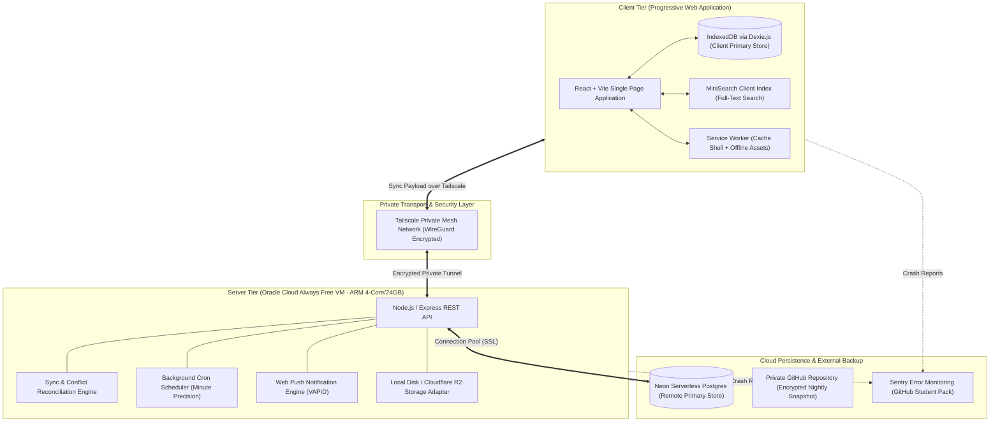
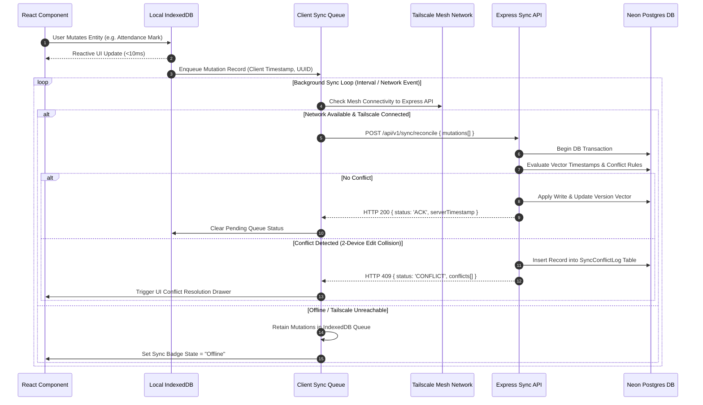
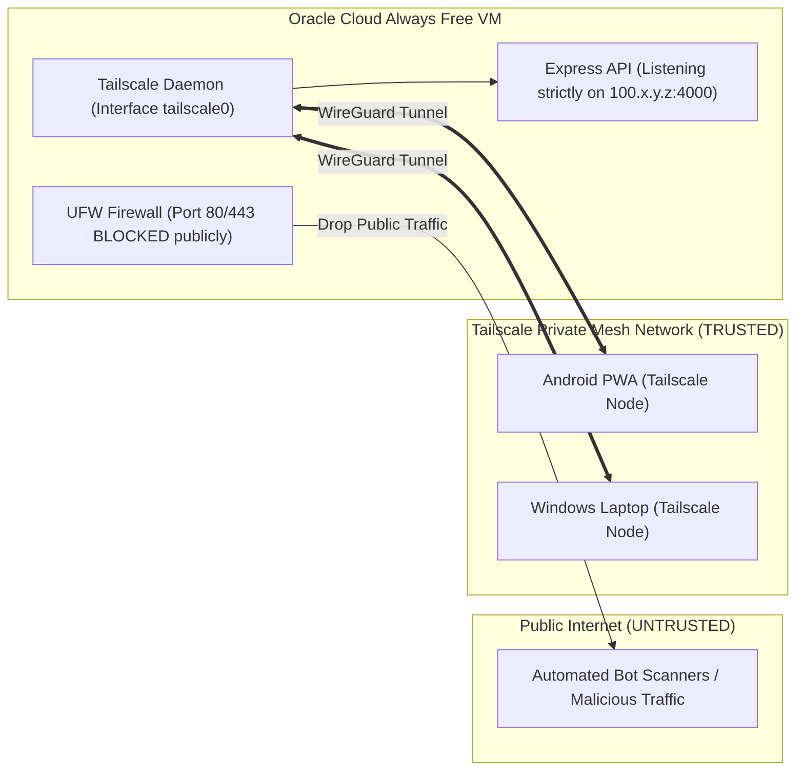

# System Architecture Specification — Student Academic OS

**Document ID:** `06_SYSTEM_ARCHITECTURE`  
**Author:** Principal Software Architect  
**Status:** Approved / Frozen Under Architecture Freeze  
**Primary References:** [Student_OS_PRD.md](file:///c:/Users/vishv/OneDrive/Desktop/Student-Academic-OS/docs/Student_OS_PRD.md), [01_PRD_REVIEW.md](file:///c:/Users/vishv/OneDrive/Desktop/Student-Academic-OS/docs/01_PRD_REVIEW.md), [00_PROJECT_OVERVIEW.md](file:///c:/Users/vishv/OneDrive/Desktop/Student-Academic-OS/docs/00_PROJECT_OVERVIEW.md), [04_USER_FLOWS.md](file:///c:/Users/vishv/OneDrive/Desktop/Student-Academic-OS/docs/04_USER_FLOWS.md), [05_INFORMATION_ARCHITECTURE.md](file:///c:/Users/vishv/OneDrive/Desktop/Student-Academic-OS/docs/05_INFORMATION_ARCHITECTURE.md)  
**Target Audience:** Staff Engineers, Lead Architects, Infrastructure Engineers, AI Implementation Agents  

---

## 1. System Purpose & Architecture Philosophy

**Student Academic OS** is a 4-year, self-hosted, zero-recurring-cost personal academic ERP built for Vishvraj Solanki (B.Tech AI & Data Science, ADIT / CVM University, Batch 2025–2029).

### Core Architectural Principles:
1. **Offline-First Baseline:** The system operates natively offline. Local IndexedDB is the primary source of truth for client reads and writes. The remote cloud database is an asynchronous persistence and multi-device synchronization target.
2. **Zero-Cost & Self-Hosted Bounds:** Infrastructure relies entirely on non-expiring free tiers: Oracle Cloud Always Free VM, Neon Serverless Postgres free tier, Cloudflare R2 object storage (10GB free), and GitHub Student Developer Pack entitlements.
3. **Private Mesh Isolation:** The backend API is not exposed to the public internet. All client-server communication is strictly routed through a private **Tailscale Mesh Network** ([01_PRD_REVIEW.md §Security Concerns](file:///c:/Users/vishv/OneDrive/Desktop/Student-Academic-OS/docs/01_PRD_REVIEW.md#security-concerns)).
4. **Partitioned Growth (4-Year Performance):** Active queries partition data by active semester (`Semester.isActive = true`). Historical data is archived lazily to ensure year-4 performance is identical to year-1.
5. **Quiet Dashboard & Soft-Delete Everywhere:** Visual alerts render only upon rule breaches (e.g., attendance < 75%). No domain record is ever permanently deleted from the database.

---

## 2. High-Level System Architecture

---

## 3. Subsystem Architectural Breakdown

### 3.1 Frontend Architecture Summary
- **Technology:** React + Vite Single Page Application (SPA) registered as a Progressive Web Application (PWA).
- **Client Storage:** IndexedDB managed via **Dexie.js**. All mutations write to IndexedDB first and emit reactive UI updates using Dexie's `useLiveQuery` hook.
- **Service Worker:** Implements a `Stale-While-Revalidate` caching strategy for app shell assets and `Network-First with IndexedDB Fallback` for API requests.
- **Cross-Reference:** Full layout and component architecture detailed in [09_FRONTEND_ARCHITECTURE.md](file:///c:/Users/vishv/OneDrive/Desktop/Student-Academic-OS/docs/09_FRONTEND_ARCHITECTURE.md).

### 3.2 Backend Architecture Summary
- **Runtime & Framework:** Node.js with Express and TypeScript executing inside a systemd daemon on the Oracle Always Free VM.
- **Layered Architecture:** Controller -> Service -> Repository -> Database Driver pattern.
- **Background Workers:** In-process `node-cron` daemon executing every minute to evaluate notification rules, generate upcoming lecture slots, and check server health.
- **Cross-Reference:** Full service and module architecture detailed in [10_BACKEND_ARCHITECTURE.md](file:///c:/Users/vishv/OneDrive/Desktop/Student-Academic-OS/docs/10_BACKEND_ARCHITECTURE.md).

### 3.3 Database Architecture Summary
- **Dual Database Pattern:** Client-side IndexedDB (primary read/write store for offline speed) mirrored to Neon Serverless Postgres (remote relational store for multi-device sync and durability).
- **Entity Model:** 13 core domain entities (`Semester`, `Subject`, `Teacher`, `Room`, `LectureSlot`, `AttendanceRecord`, `CalendarEvent`, `Note`, `Task`, `Exam`, `Resource`, `NotificationRule`, `AnalyticsEvent`).
- **Cross-Reference:** Complete ER diagrams and schema specifications detailed in [07_DATABASE_ARCHITECTURE.md](file:///c:/Users/vishv/OneDrive/Desktop/Student-Academic-OS/docs/07_DATABASE_ARCHITECTURE.md).

---

## 4. Offline & Synchronization Architecture

### 4.1 Sync Flow Sequence

### 4.2 Two-Device Conflict Resolution Policy
As mandated in [01_PRD_REVIEW.md §Weakness #1](file:///c:/Users/vishv/OneDrive/Desktop/Student-Academic-OS/docs/01_PRD_REVIEW.md#weaknesses):
- Low-stakes entities (`Note` drafts, `Task` title edits) use **Last-Write-Wins (LWW)** with UTC timestamp comparison.
- High-stakes entities (`AttendanceRecord`, `LectureSlot` overrides) use an **Explicit Multi-Device Conflict Queue**. When a collision is detected, both local and remote states are preserved in `SyncConflictLog`, and an interactive prompt asks the user to pick the authoritative version ([04_USER_FLOWS.md §Flow 11](file:///c:/Users/vishv/OneDrive/Desktop/Student-Academic-OS/docs/04_USER_FLOWS.md#flow-11-two-device-offline-edit-conflict-queue)).

---

## 5. Security & Network Boundary Architecture

### Security Decisions ([01_PRD_REVIEW.md §Security Concerns](file:///c:/Users/vishv/OneDrive/Desktop/Student-Academic-OS/docs/01_PRD_REVIEW.md#security-concerns)):
1. **Zero Public Port Exposure:** UFW firewall drops all incoming public web traffic on ports 80, 443, and 4000.
2. **Tailscale Mesh Authentication:** API traffic is accessible strictly via Tailscale's encrypted WireGuard mesh network (`100.x.y.z` CGNAT IP range).
3. **PIN Token Defense-in-Depth:** Requests over Tailscale require a `X-Student-OS-PIN-Token` header, providing double-layered protection against unauthorized local device access.

---

## 6. Resilience & Monitoring Strategy

### 6.1 Server Downtime & Alerting Pipeline
1. **Heartbeat Checker:** An external free ping monitor (e.g., UptimeRobot) pings `/api/v1/health` over a public lightweight health wrapper or Tailscale webhook.
2. **Email Failover Alert:** If the server is unreachable for $>15$ minutes, an automated email is sent to Vishvraj's inbox. Push notifications are NOT relied upon for VM outages because the notification engine runs on the affected VM ([04_USER_FLOWS.md §Flow 15](file:///c:/Users/vishv/OneDrive/Desktop/Student-Academic-OS/docs/04_USER_FLOWS.md#flow-15-vm-downtime-detection--email-failover-alerting)).

### 6.2 Off-Site GitHub Automated Backup
Nightly at 03:00 AM UTC, the VM executes a script that:
1. Generates a complete JSON database snapshot.
2. Encrypts the snapshot using AES-256-GCM.
3. Commits and pushes the encrypted file to a private GitHub repository.

---

## 7. Architecture Trade-Offs & Rejected Alternatives

| Decision | Chosen Architecture | Rejected Alternative | Rationale & Trade-Off |
| :--- | :--- | :--- | :--- |
| **API Boundary** | Tailscale Private Mesh | Public REST API + HTTPS SSL Certs | Tailscale eliminates public vulnerability scanners and Let's Encrypt renewal cycles at zero cost. Trade-off: Requires Tailscale client on devices. |
| **Offline Store** | IndexedDB via Dexie.js | LocalStorage / SQLite WASM | Dexie offers high-performance indexed queries and reactive `useLiveQuery` hooks without WASM bundle bloat. |
| **Conflict Resolution** | Explicit Queue for Attendance | Global Last-Write-Wins (LWW) | LWW silently destroys attendance marks made on different offline devices. Conflict queue guarantees data accuracy for CVM 75% rule. |
| **File Attachments** | Filesystem / Cloudflare R2 | Storing Files as Postgres Blobs | DB blobs cause database bloat and slow down backups. Storing file references keeps Postgres lightweight ([01_PRD_REVIEW.md §Scalability](file:///c:/Users/vishv/OneDrive/Desktop/Student-Academic-OS/docs/01_PRD_REVIEW.md#scalability-concerns)). |
