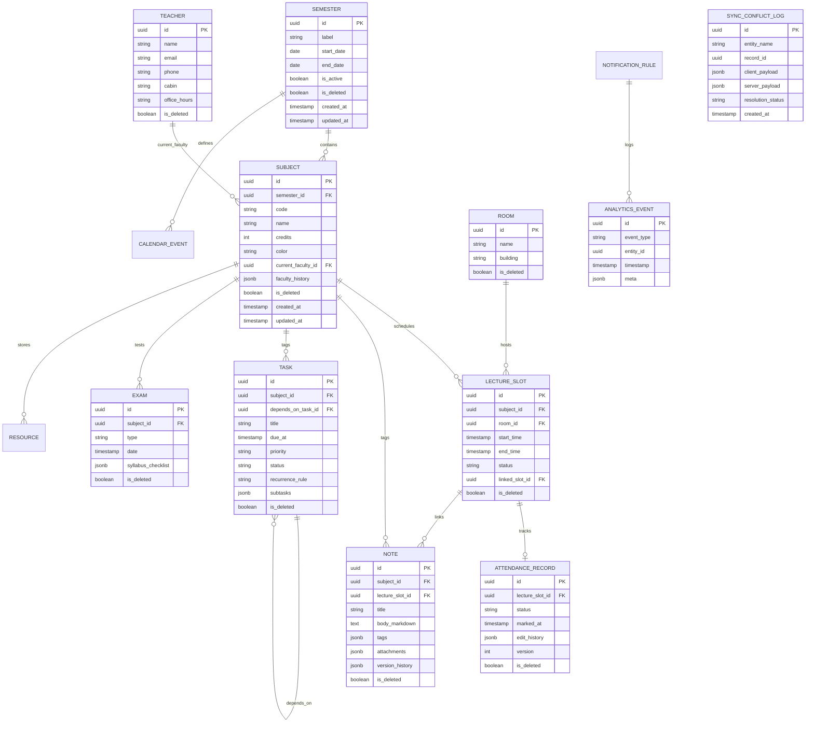

# Database Architecture Specification — Student Academic OS

**Document ID:** `07_DATABASE_ARCHITECTURE`  
**Author:** Principal Software Architect  
**Status:** Approved / Frozen Under Architecture Freeze  
**Primary References:** [Student_OS_PRD.md §23](file:///c:/Users/vishv/OneDrive/Desktop/Student-Academic-OS/docs/Student_OS_PRD.md#23-database-architecture), [01_PRD_REVIEW.md §Scalability, §Sync](file:///c:/Users/vishv/OneDrive/Desktop/Student-Academic-OS/docs/01_PRD_REVIEW.md), [06_SYSTEM_ARCHITECTURE.md](file:///c:/Users/vishv/OneDrive/Desktop/Student-Academic-OS/docs/06_SYSTEM_ARCHITECTURE.md)  
**Target Audience:** Database Administrators, Backend Engineers, Data Architects, AI Implementation Agents  

---

## 1. Database Design Philosophy

The database architecture for **Student Academic OS** utilizes a **Dual Primary Data Architecture**:
1. **Client Primary Store (IndexedDB via Dexie.js):** Executes on client devices (Android PWA, Desktop Browser) to deliver instant read/write operations with zero network dependency.
2. **Cloud Relational Store (Neon Serverless Postgres):** Executes on cloud infrastructure as the authoritative cross-device synchronization target and long-term analytical archive.

```
                              DUAL DATABASE ARCHITECTURE
┌──────────────────────────────────────────────┐    ┌──────────────────────────────────────────────┐
│           CLIENT PRIMARY (Dexie.js)          │    │            CLOUD PRIMARY (Neon Postgres)     │
│ • Storage Engine: Browser IndexedDB          │    │ • Storage Engine: Serverless Postgres DB     │
│ • Primary Role: Instant read/write (<10ms)   │    │ • Primary Role: Multi-device sync & vault    │
│ • Key Generator: Client-side UUID v4         │<==>│ • Access Protocol: Pooled SSL over Tailscale │
│ • State Scope: Active + Recent Semesters     │    │ • State Scope: Complete 4-Year Record        │
└──────────────────────────────────────────────┘    └──────────────────────────────────────────────┘
```

---

## 2. Master Entity-Relationship Diagram (ERD)



---

## 3. Comprehensive Entity Specifications & Schema Dictionary

### 3.1 Entity: `Semester`
- **Purpose:** Represents an academic semester (Semesters 1 through 8 across 2025–2029).

| Attribute | Data Type (Postgres) | Dexie Type | Constraints & Rules |
| :--- | :--- | :--- | :--- |
| `id` | `UUID` | `string` | Primary Key (Client UUID v4) |
| `label` | `VARCHAR(50)` | `string` | Example: "Semester 1 (Fall 2025)" |
| `start_date` | `DATE` | `string` | Semester start bound |
| `end_date` | `DATE` | `string` | Semester end bound |
| `is_active` | `BOOLEAN` | `boolean` | `true` for currently active semester (Only one active at a time) |
| `is_deleted` | `BOOLEAN` | `boolean` | Default `false` (Soft-delete) |

---

### 3.2 Entity: `Subject`
- **Purpose:** Academic subject/course enrolled during a specific semester.

| Attribute | Data Type (Postgres) | Dexie Type | Constraints & Rules |
| :--- | :--- | :--- | :--- |
| `id` | `UUID` | `string` | Primary Key |
| `semester_id` | `UUID` | `string` | Foreign Key -> `Semester.id` |
| `code` | `VARCHAR(20)` | `string` | Example: "2AI01" |
| `name` | `VARCHAR(100)`| `string` | Example: "Data Structures & Algorithms" |
| `credits` | `INT` | `number` | Course credit weight (e.g. 4) |
| `color` | `VARCHAR(7)` | `string` | Hex code for UI representation (e.g. "#4F46E5") |
| `current_faculty_id`| `UUID` | `string` | Foreign Key -> `Teacher.id` |
| `faculty_history` | `JSONB` | `Array<Object>`| Inlined JSON: `[{ teacherId, startDate, endDate }]` |
| `is_deleted` | `BOOLEAN` | `boolean` | Default `false` |

---

### 3.3 Entity: `LectureSlot`
- **Purpose:** Individual timetable instances (scheduled, extra, cancelled, or rescheduled lectures).

| Attribute | Data Type (Postgres) | Dexie Type | Constraints & Rules |
| :--- | :--- | :--- | :--- |
| `id` | `UUID` | `string` | Primary Key |
| `subject_id` | `UUID` | `string` | Foreign Key -> `Subject.id` |
| `room_id` | `UUID` | `string` | Foreign Key -> `Room.id` |
| `start_time` | `TIMESTAMPTZ` | `string` | Slot start ISO timestamp |
| `end_time` | `TIMESTAMPTZ` | `string` | Slot end ISO timestamp (`end_time > start_time`) |
| `status` | `VARCHAR(20)` | `string` | Enum: `'scheduled' \| 'cancelled' \| 'rescheduled' \| 'extra'` |
| `linked_slot_id`| `UUID` | `string` | Foreign Key -> `LectureSlot.id` (For rescheduled pairs) |
| `is_deleted` | `BOOLEAN` | `boolean` | Default `false` |

---

### 3.4 Entity: `AttendanceRecord`
- **Purpose:** Per-lecture attendance mark supporting CVM University's 5-state policy.

| Attribute | Data Type (Postgres) | Dexie Type | Constraints & Rules |
| :--- | :--- | :--- | :--- |
| `id` | `UUID` | `string` | Primary Key |
| `lecture_slot_id`| `UUID` | `string` | Foreign Key -> `LectureSlot.id` (Unique per slot) |
| `status` | `VARCHAR(20)` | `string` | Enum: `'present' \| 'absent' \| 'late' \| 'medical' \| 'onduty'` |
| `marked_at` | `TIMESTAMPTZ` | `string` | Timestamp when first recorded |
| `edit_history` | `JSONB` | `Array<Object>`| Audit trail: `[{ prevStatus, newStatus, editedAt, reason }]` |
| `version` | `INT` | `number` | Version counter for sync conflict detection |
| `is_deleted` | `BOOLEAN` | `boolean` | Default `false` |

---

### 3.5 Entity: `SyncConflictLog`
- **Purpose:** Stores unresolved 2-device sync collisions for manual user pick ([01_PRD_REVIEW.md §Weakness #1](file:///c:/Users/vishv/OneDrive/Desktop/Student-Academic-OS/docs/01_PRD_REVIEW.md#weaknesses)).

| Attribute | Data Type (Postgres) | Dexie Type | Constraints & Rules |
| :--- | :--- | :--- | :--- |
| `id` | `UUID` | `string` | Primary Key |
| `entity_name` | `VARCHAR(50)` | `string` | Table name (e.g. `'AttendanceRecord'`) |
| `record_id` | `UUID` | `string` | ID of colliding record |
| `client_payload`| `JSONB` | `Object` | Payload from local device |
| `server_payload`| `JSONB` | `Object` | Payload existing on cloud DB |
| `resolution_status`|`VARCHAR(20)`| `string` | Enum: `'pending' \| 'resolved_client' \| 'resolved_server'` |

---

### 3.6 Entity: `AnalyticsEvent`
- **Purpose:** Append-only event log designed specifically for future AI analytics queries ([Student_OS_PRD.md §23](file:///c:/Users/vishv/OneDrive/Desktop/Student-Academic-OS/docs/Student_OS_PRD.md#23-database-architecture)).

| Attribute | Data Type (Postgres) | Dexie Type | Constraints & Rules |
| :--- | :--- | :--- | :--- |
| `id` | `UUID` | `string` | Primary Key |
| `event_type` | `VARCHAR(50)` | `string` | Example: `'ATTENDANCE_MARKED'`, `'TASK_COMPLETED'` |
| `entity_id` | `UUID` | `string` | ID of associated entity |
| `timestamp` | `TIMESTAMPTZ` | `string` | Log timestamp |
| `meta` | `JSONB` | `Object` | Flexible contextual metadata payload |

---

## 4. Database Optimization & Indexing Strategy

To maintain sub-10ms response times on local devices and low cloud CPU utilization, the following Postgres B-Tree and GIN indexes are declared:

```sql
-- Postgres Index Definitions (Cloud Database)
CREATE INDEX idx_subject_semester ON Subject(semester_id) WHERE is_deleted = false;
CREATE INDEX idx_slot_subject_time ON LectureSlot(subject_id, start_time) WHERE is_deleted = false;
CREATE INDEX idx_attendance_slot ON AttendanceRecord(lecture_slot_id) WHERE is_deleted = false;
CREATE INDEX idx_note_subject ON Note(subject_id) WHERE is_deleted = false;
CREATE INDEX idx_task_due ON Task(due_at, status) WHERE is_deleted = false;

-- GIN Indexes for JSONB & Full-Text Search
CREATE INDEX idx_note_tags_gin ON Note USING GIN (tags);
CREATE INDEX idx_analytics_meta_gin ON AnalyticsEvent USING GIN (meta);
```

### Dexie.js (IndexedDB) Store Definitions:
```javascript
// Dexie.js Schema Declaration (Client Database)
const db = new Dexie('StudentAcademicOSDB');
db.version(1).stores({
  semesters: 'id, is_active, is_deleted',
  subjects: 'id, semester_id, code, is_deleted',
  lectureSlots: 'id, subject_id, start_time, status, is_deleted',
  attendanceRecords: 'id, lecture_slot_id, status, is_deleted',
  notes: 'id, subject_id, title, *tags, is_deleted',
  tasks: 'id, subject_id, due_at, status, is_deleted',
  exams: 'id, subject_id, date, is_deleted',
  syncConflictLogs: 'id, record_id, resolution_status'
});
```

---

## 5. Storage, Migration & Partitioning Strategy

### 5.1 Semester Partitioning & Data Lifecycle
- **Active Partition:** Client queries by default scope to `Semester.is_active = true`. This bounds active IndexedDB working memory to ~500 slots and ~100 notes.
- **Archiving Lifecycle:** Advancing semesters sets `is_active = false`. Archived semesters are stored in the local DB but read only when opening the **Semester Archive** module ([05_INFORMATION_ARCHITECTURE.md §4](file:///c:/Users/vishv/OneDrive/Desktop/Student-Academic-OS/docs/05_INFORMATION_ARCHITECTURE.md#screen-10-semester-archive-archive)).

### 5.2 File Attachment Storage Strategy
- As specified in [01_PRD_REVIEW.md §Scalability](file:///c:/Users/vishv/OneDrive/Desktop/Student-Academic-OS/docs/01_PRD_REVIEW.md#scalability-concerns), PDF/Image attachments are **NOT stored as DB bytea blobs**.
- Attachments are stored on the Oracle VM filesystem or Cloudflare R2 object storage. The `Note.attachments` JSON array stores metadata and file URLs: `[{ fileId, fileName, mimeType, storageUrl, sizeBytes }]`.

### 5.3 Database Migration Strategy
- **Client (Dexie.js):** Uses Dexie versioned upgrades (`db.version(2).stores(...).upgrade()`).
- **Server (Postgres):** Managed via **Kysely** or **Prisma Migrations** executing idempotent SQL DDL scripts inside system startup hooks.
