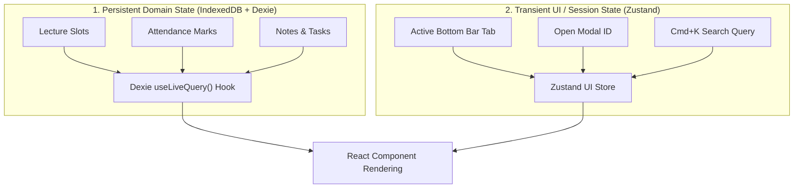

# Frontend Architecture Specification — Student Academic OS

**Document ID:** `09_FRONTEND_ARCHITECTURE`  
**Author:** Principal Software Architect  
**Status:** Approved / Frozen Under Architecture Freeze  
**Primary References:** [Student_OS_PRD.md §4, §9-§13](file:///c:/Users/vishv/OneDrive/Desktop/Student-Academic-OS/docs/Student_OS_PRD.md), [01_PRD_REVIEW.md §UX, §PWA](file:///c:/Users/vishv/OneDrive/Desktop/Student-Academic-OS/docs/01_PRD_REVIEW.md), [05_INFORMATION_ARCHITECTURE.md](file:///c:/Users/vishv/OneDrive/Desktop/Student-Academic-OS/docs/05_INFORMATION_ARCHITECTURE.md)  
**Target Audience:** Frontend Engineers, UX Developers, PWA Architects, AI Implementation Agents  

---

## 1. Frontend Technology Stack & Design System

The frontend is architected as an **offline-first Progressive Web Application (PWA)** built with React, Vite, Dexie.js, and Vanilla CSS Modules.

### Stack Specifications:
- **Core Framework:** React (Vite bundler)
- **Offline Client Store:** Dexie.js (IndexedDB wrapper with reactive hooks)
- **Styling Architecture:** Vanilla CSS with CSS Variables & Tokens (No heavy UI frameworks or Tailwind dependencies unless explicitly requested)
- **Full-Text Search Engine:** MiniSearch (In-memory fuzzy search index executing over IndexedDB)
- **Iconography:** Lucide Icons (`lucide-react`)
- **State Management:** Dexie `useLiveQuery` (Persistent Data) + Zustand (Transient Session/UI State)
- **Schema Validation:** Zod

---

## 2. Directory Layout & Feature Modularization

```
src/
├── app/                        # Main Application Shell & App Providers
│   ├── App.tsx                 # Root Component & Layout Router
│   ├── main.tsx                # Entry Point & Service Worker Registration
│   └── routes.tsx              # React Router v6 Configuration
├── components/                 # Shared UI Design System Components
│   ├── ui/                     # Atomic UI Elements (Button, Card, Modal, Input, Badge)
│   ├── feedback/               # Banners, Toast, Skeleton Loaders, Error Boundaries
│   └── layout/                 # Mobile Bottom Bar, Desktop Sidebar, Header, FAB
├── db/                         # Client Database Engine & Schemas
│   ├── index.ts                # Dexie.js Instance & Table Definitions
│   ├── seeds.ts                # Initial Data / Mock Timetable Seeding
│   └── repositories/           # IndexedDB Data Access Layer (DAL)
├── features/                   # Feature Modules (Domain Isolated)
│   ├── dashboard/              # Next Class, Risk Banner, Slot Strip, Due Tasks
│   ├── timetable/              # Weekly Grid, Daily Feed, Calendar Overlay, Slot Sheet
│   ├── attendance/             # Subject Heatmaps, Safe-to-Skip Math, Audit Log
│   ├── notes/                  # Markdown Editor, Tag Cloud, Attachment Viewer
│   ├── tasks/                  # Task Lists, Subtask Drawer, Dependency Graph
│   ├── exams/                  # Exam Countdowns, Syllabus Checklist
│   ├── directory/              # Teachers & Rooms Directory
│   ├── archive/                # Semester Archive Viewer
│   └── sync/                   # Sync Badge, Conflict Resolution Modal
├── hooks/                      # Custom React Hooks
│   ├── useAttendanceMath.ts    # Live Safe-to-Skip & Percentage Calculator
│   ├── useSyncState.ts         # Network & Tailscale Connection Listener
│   └── useCommandPalette.ts    # Cmd+K Listener & Hotkey Handler
├── services/                   # Background Services & Sync Engines
│   ├── syncEngine.ts           # IndexedDB <-> Tailscale API Reconciler
│   ├── miniSearchService.ts    # Search Index Management
│   └── pushNotification.ts     # VAPID Web Push Subscription Handler
├── styles/                     # CSS Design Tokens & Base Rules
│   ├── tokens.css              # Color Palettes, Spacing, Typography Tokens
│   ├── global.css              # Reset Rules, Typography Rules
│   └── themes.css              # Sleek Dark Mode (Default) & Light Theme Tokens
└── types/                      # TypeScript Interfaces & Domain Types
```

---

## 3. UI/UX Design System & Token Architecture

As mandated in [Student_OS_PRD.md §12](file:///c:/Users/vishv/OneDrive/Desktop/Student-Academic-OS/docs/Student_OS_PRD.md#12-dashboard-design) and Web Application Guidelines, the UI uses curated, premium aesthetics, vibrant dark modes, and subtle micro-animations:

### 3.1 CSS Design Tokens (`tokens.css`)
```css
:root {
  /* Color Palette - Premium Sleek Dark Mode (Default) */
  --bg-app: #090d16;
  --bg-surface: #111827;
  --bg-surface-elevated: #1f2937;
  --border-subtle: rgba(255, 255, 255, 0.08);
  --border-accent: rgba(99, 102, 241, 0.3);

  /* Brand Accents */
  --accent-primary: #6366f1;       /* Indigo */
  --accent-secondary: #8b5cf6;     /* Purple */
  --accent-success: #10b981;       /* Emerald */
  --accent-warning: #f59e0b;       /* Amber */
  --accent-danger: #ef4444;        /* Rose */

  /* Typography */
  --font-sans: 'Inter', system-ui, -apple-system, sans-serif;
  --font-mono: 'JetBrains Mono', monospace;

  /* Elevation & Glassmorphism */
  --glass-bg: rgba(17, 24, 39, 0.75);
  --glass-blur: blur(12px);
  --shadow-elevation: 0 10px 30px -10px rgba(0, 0, 0, 0.5);
}
```

---

## 4. State Management & Reactive Data Layer

The frontend separates state into two distinct categories:



### Data Layer Execution Rule:
React components **NEVER** fetch data directly from HTTP API endpoints on initial render. Components subscribe to local IndexedDB tables using `useLiveQuery()`. Updates to local IndexedDB render to the screen in $<10\text{ms}$. The background `syncEngine` reconciles changes with Neon Postgres asynchronously over Tailscale.

---

## 5. Keyboard Navigation & Accessibility (Command Palette)

- **Command Palette (`Cmd+K` / `Ctrl+K`):** Intercepts global keyboard shortcuts. Renders a modal search interface built with `MiniSearch`.
- **Keyboard Shortcuts:**
  - `Cmd + K`: Open Command Palette / Global Search.
  - `Alt + A`: Quick Mark Attendance for current slot.
  - `Alt + N`: Create New Note.
  - `Esc`: Close open modal/drawer.

---

## 6. PWA Lifecycle & Cache Invalidation Strategy

To resolve the PWA cache invalidation issues identified in [01_PRD_REVIEW.md §Weakness #5](file:///c:/Users/vishv/OneDrive/Desktop/Student-Academic-OS/docs/01_PRD_REVIEW.md#weaknesses):

1. **Versioned Service Worker Manifest:** Vite PWA plugin injects a content-hashed asset manifest into `sw.js`.
2. **Immediate Update Prompt:** When a new service worker is deployed, a subtle toast banner alerts the user: *"App update available. [Reload to Update]"*.
3. **Cache Partitioning:**
   - App Shell Assets (`JS/CSS/Fonts`): `Stale-While-Revalidate`.
   - Dynamic API Routes (`/api/v1/...`): `Network-First with IndexedDB Fallback`.
   - File Attachments: `Cache-First` with max-age headers.
