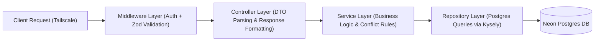

# Backend Architecture Specification — Student Academic OS

**Document ID:** `10_BACKEND_ARCHITECTURE`  
**Author:** Principal Software Architect  
**Status:** Approved / Frozen Under Architecture Freeze  
**Primary References:** [Student_OS_PRD.md §4, §20, §23, §24](file:///c:/Users/vishv/OneDrive/Desktop/Student-Academic-OS/docs/Student_OS_PRD.md), [01_PRD_REVIEW.md §Security, §Sync](file:///c:/Users/vishv/OneDrive/Desktop/Student-Academic-OS/docs/01_PRD_REVIEW.md), [06_SYSTEM_ARCHITECTURE.md](file:///c:/Users/vishv/OneDrive/Desktop/Student-Academic-OS/docs/06_SYSTEM_ARCHITECTURE.md), [08_API_SPECIFICATION.md](file:///c:/Users/vishv/OneDrive/Desktop/Student-Academic-OS/docs/08_API_SPECIFICATION.md)  
**Target Audience:** Backend Engineers, System Administrators, DevOps, AI Implementation Agents  

---

## 1. Backend Architecture & Runtime Overview

The backend of **Student Academic OS** runs as a Node.js + Express TypeScript service deployed on an Oracle Cloud Always Free VM (ARM 4-Core / 24GB RAM). It acts as the primary data persistence engine, background scheduler, notification publisher, and multi-device sync coordinator.

### Core Architecture Standards:
- **Layered Architecture:** Controller -> Service -> Repository -> Database.
- **Strict Network Boundary:** Tailscale Mesh Network binding (`100.x.y.z`).
- **Database Driver:** Kysely / Prisma connection pool to Neon Serverless Postgres.
- **Validation Engine:** Zod request schema validation middleware.
- **Logging Infrastructure:** Pino structured JSON logging.

---

## 2. Directory Layout & Layered Architecture

```
server/
├── src/
│   ├── config/                 # Environment Variables & App Configuration
│   │   ├── env.ts              # Zod Parsed Process Environment Vars
│   │   ├── database.ts         # Neon Postgres Connection Pool Setup
│   │   └── tailscale.ts        # Tailscale Network Interface Binding Config
│   ├── controllers/            # HTTP Request Handlers (DTO Validation -> Service)
│   │   ├── dashboardController.ts
│   │   ├── attendanceController.ts
│   │   ├── syncController.ts
│   │   └── dataController.ts   # Import / Export Handlers
│   ├── services/               # Core Business Logic & Domain Services
│   │   ├── attendanceService.ts# 5-State & Safe-to-Skip Calculation Logic
│   │   ├── syncService.ts      # Multi-Device Conflict Detection & Reconciliation
│   │   ├── pushService.ts      # VAPID Web Push Notification Engine
│   │   └── backupService.ts    # Nightly Encrypted GitHub Export Service
│   ├── repositories/           # Database Access Layer (Postgres SQL Queries)
│   │   ├── slotRepository.ts
│   │   ├── attendanceRepository.ts
│   │   └── analyticsRepository.ts
│   ├── middleware/             # Express Middleware Pipeline
│   │   ├── tailscaleAuth.ts    # IP Range & PIN Token Header Verifier
│   │   ├── validateSchema.ts   # Zod Validation Middleware
│   │   └── errorHandler.ts     # Global Exception & Sentry Logger
│   ├── engines/                # Autonomous Background Daemons
│   │   ├── cronScheduler.ts    # Minute-Precision Rule Checker (node-cron)
│   │   └── heartbeatWorker.ts  # Health Checker & Email Alert Worker
│   ├── types/                  # TypeScript Data Types & Interfaces
│   └── app.ts                  # Express Application Setup & Route Binding
└── index.ts                    # Application Bootstrapper & Systemd Entrypoint
```

---

## 3. Layered Architecture Flow & Responsibilities



| Layer | Responsibility | Prohibited Actions |
| :--- | :--- | :--- |
| **Middleware** | IP verification (Tailscale), PIN token check, Zod payload validation | Must NOT contain database queries or business logic |
| **Controller** | Parse DTOs, invoke services, format HTTP success/error responses | Must NOT execute raw SQL or handle transaction rollbacks |
| **Service** | Attendance math, conflict detection, push alert rules, backup logic | Must NOT interact directly with Express `req` / `res` objects |
| **Repository** | Execute SQL queries, database transactions, table joins | Must NOT contain HTTP logic or business rules |

---

## 4. Background Engines Architecture

### 4.1 Cron Scheduler Engine (`cronScheduler.ts`)
- Executed using `node-cron` with **1-minute precision**.
- **Tasks Executed:**
  - **Every 1 Minute:** Evaluates `NotificationRule` records against upcoming `LectureSlot` times (e.g. 20-min pre-class alert) and fires VAPID Web Push alerts ([Student_OS_PRD.md §20](file:///c:/Users/vishv/OneDrive/Desktop/Student-Academic-OS/docs/Student_OS_PRD.md#20-notification-engine)).
  - **Every 1 Hour:** Checks attendance risk threshold (< 75%) and emits attendance risk push alerts.
  - **Nightly at 03:00 AM:** Triggers `backupService.ts` to execute encrypted off-site GitHub backups.

### 4.2 Sync & Conflict Resolution Engine (`syncService.ts`)
- Processes client mutation arrays during `POST /api/v1/sync/reconcile`.
- **Conflict Strategy:**
  - Compares client `version` vectors and `markedAt` timestamps against server records.
  - If a collision occurs on high-stakes entities (`AttendanceRecord`), it flags the conflict, writes both payloads to `SyncConflictLog`, and returns HTTP 409 ([07_DATABASE_ARCHITECTURE.md §3](file:///c:/Users/vishv/OneDrive/Desktop/Student-Academic-OS/docs/07_DATABASE_ARCHITECTURE.md#35-entity-syncconflictlog)).

---

## 5. Security Middleware & Tailscale Isolation

```typescript
// Architectural Specification: Tailscale Authentication Middleware
// Enforces that incoming requests originate from Tailscale CGNAT IPs (100.64.0.0/10)
// and present a valid X-Student-OS-PIN-Token header.

export const tailscaleAuthMiddleware = (req, res, next) => {
  const clientIp = req.ip || req.socket.remoteAddress;
  const pinToken = req.headers['x-student-os-pin-token'];

  // 1. Verify Tailscale IP Boundary
  if (!isTailscaleIp(clientIp)) {
    return res.status(403).json({
      success: false,
      error: { code: 'FORBIDDEN_IP', message: 'Access denied: Must use Tailscale Mesh' }
    });
  }

  // 2. Verify Session PIN Token
  if (!validatePinToken(pinToken)) {
    return res.status(401).json({
      success: false,
      error: { code: 'UNAUTHORIZED_PIN', message: 'Invalid or expired session token' }
    });
  }

  next();
};
```

---

## 6. Recommended Libraries & Trade-Offs

| Tool / Library | Purpose | Rationale |
| :--- | :--- | :--- |
| **Express** | HTTP Routing & Middleware | Lightweight, stable, low memory footprint on Oracle VM |
| **Kysely** | Type-safe SQL Query Builder | Zero build-step overhead, explicit SQL generation, light bundle |
| **web-push** | VAPID Push Dispatcher | Pure Node implementation of Web Push protocol without SaaS dependencies |
| **Pino** | Structured JSON Logging | Fast asynchronous logger with minimal CPU overhead |
| **Zod** | Runtime Type Validation | Shared validation schemas across client and server |
