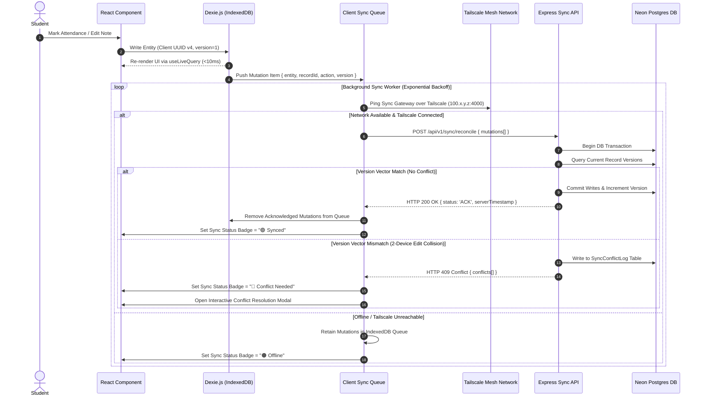

# Offline & Synchronization Systems Specification — Student Academic OS

**Document ID:** `11_OFFLINE_AND_SYNC`  
**Author:** Principal Systems Engineer  
**Status:** Approved / Frozen Under Implementation Freeze  
**Primary References:** [Student_OS_PRD.md §24](file:///c:/Users/vishv/OneDrive/Desktop/Student-Academic-OS/docs/Student_OS_PRD.md#24-api-design), [01_PRD_REVIEW.md §Weakness #1, §Sync](file:///c:/Users/vishv/OneDrive/Desktop/Student-Academic-OS/docs/01_PRD_REVIEW.md), [06_SYSTEM_ARCHITECTURE.md §4](file:///c:/Users/vishv/OneDrive/Desktop/Student-Academic-OS/docs/06_SYSTEM_ARCHITECTURE.md#4-offline--synchronization-architecture), [07_DATABASE_ARCHITECTURE.md §3](file:///c:/Users/vishv/OneDrive/Desktop/Student-Academic-OS/docs/07_DATABASE_ARCHITECTURE.md#35-entity-syncconflictlog), [08_API_SPECIFICATION.md §3.3](file:///c:/Users/vishv/OneDrive/Desktop/Student-Academic-OS/docs/08_API_SPECIFICATION.md#33-module-synchronization--conflict-resolution)  
**Target Audience:** Systems Engineers, Lead Developers, Data Engineers, AI Implementation Agents  

---

## 1. Offline Philosophy & Data Ownership

**Student Academic OS** treats client devices as authoritative data origins. Because campus lecture halls and computer labs frequently experience zero cellular connectivity, **100% of read and write actions function locally without network latency or server dependencies**.

### Data Ownership Rules:
1. **Client Primary Ownership:** Local IndexedDB (via Dexie.js) is the primary read/write target for active user sessions.
2. **Asynchronous Remote Target:** Neon Serverless Postgres acts as the remote persistence vault and cross-device sync coordinator.
3. **Optimistic Local Execution:** Every UI action mutates local IndexedDB state instantly ($<10\text{ms}$ execution) and enqueues an item in `ClientSyncQueue`.

---

## 2. Master Synchronization Sequence & Architecture



---

## 3. Conflict Detection & Merge Strategies

As mandated in [01_PRD_REVIEW.md §Weakness #1](file:///c:/Users/vishv/OneDrive/Desktop/Student-Academic-OS/docs/01_PRD_REVIEW.md#weaknesses), different domain entities enforce distinct merge policies to prevent silent data destruction:

```mermaid
flowchart TD
    A[Sync Engine Receives Mutation] --> B{Entity Category}
    
    B -- Low-Stakes Entity --> C[Notes, Tasks, Resources]
    C --> D[Apply Last-Write-Wins (LWW) via UTC Timestamp]
    D --> E[Commit Server Write & Acknowledge]

    B -- High-Stakes Entity --> F[AttendanceRecord, LectureSlot status]
    F --> G{Version Collides?}
    G -- No --> E
    G -- Yes --> H[Write both records to SyncConflictLog Table]
    H --> I[Return HTTP 409 & Prompt User Choice on Client UI]
```

### Strategy Matrix:

| Domain Entity | Conflict Strategy | Rationale & PRD Justification |
| :--- | :--- | :--- |
| `AttendanceRecord` | **Explicit Conflict Queue** | Attendance directly impacts CVM 75% rule. Silent LWW overwrites between phone and laptop are unacceptable ([01_PRD_REVIEW.md §Weakness #1](file:///c:/Users/vishv/OneDrive/Desktop/Student-Academic-OS/docs/01_PRD_REVIEW.md#weaknesses)). |
| `LectureSlot` (status) | **Explicit Conflict Queue** | Prevents cancelled vs rescheduled slot collisions. |
| `Note` (bodyMarkdown) | **Last-Write-Wins (LWW)** | Low-frequency collision risk; timestamp resolution is sufficient. |
| `Task` (status/dueAt) | **Last-Write-Wins (LWW)** | Completion status merges safely based on latest UTC timestamp. |
| `Exam` (syllabusChecklist) | **Field-Level Union Merge** | Checklist checkboxes merge set unions (`Checklist_A ∪ Checklist_B`). |

---

## 4. Sync Queue Management, Retry Policy & Failure Recovery

### 4.1 Exponential Backoff Algorithm
When the `BackgroundSyncWorker` encounters network failures or server timeouts, it executes an **Exponential Backoff with Jitter** retry policy:

$$t_{\text{retry}} = \min\left(t_{\text{max}}, \; t_{\text{base}} \times 2^{\text{attempt}} + \text{rand}(0, 1000\text{ms})\right)$$

- $t_{\text{base}} = 2000\text{ms}$ (2 seconds)
- $t_{\text{max}} = 300000\text{ms}$ (5 minutes)
- **Max Retries:** Unlimited (Queue persists in IndexedDB until sync succeeds).

### 4.2 Queue Schema in IndexedDB (`ClientSyncQueue`)
```typescript
interface ClientSyncQueueItem {
  id: string;                 // UUID v4 queue entry ID
  entityName: string;         // 'AttendanceRecord' | 'Note' | 'Task' ...
  recordId: string;           // Target entity Primary Key
  action: 'UPSERT' | 'DELETE';// Operation type
  payload: object;            // Complete serialized record payload
  clientVersion: number;      // Incremental version counter
  createdAt: string;          // ISO-8601 client timestamp
  attemptCount: number;       // Number of sync attempts
  lastError?: string;         // Error message if previous attempt failed
}
```

---

## 5. Network Recovery & Cross-Device Behavior

### 5.1 Connection State Transition Machine

```
┌─────────────────┐       Tailscale Network Reconnected      ┌─────────────────┐
│     OFFLINE     │ ───────────────────────────────────────> │    SYNCING      │
│ (IndexedDB Read)│ <─────────────────────────────────────── │ (Reconciling)   │
└─────────────────┘        Tailscale Network Disconnected    └─────────────────┘
                                                                      │
                                                                      │ Batch ACK Received
                                                                      v
                                                             ┌─────────────────┐
                                                             │     SYNCED      │
                                                             │ (🟢 All Quiet)  │
                                                             └─────────────────┘
```

### 5.2 Offline PWA Storage Quota Management
- Browser IndexedDB storage is requested as `persistent-storage` via the StorageManager API (`navigator.storage.persist()`).
- Data footprint for 4 years of text/json state occupies ~15MB (excluding attachments).
- File attachments (PDFs/Images) are cached on local disk / Cloudflare R2 object storage to keep browser IndexedDB memory lightweight ([01_PRD_REVIEW.md §Scalability](file:///c:/Users/vishv/OneDrive/Desktop/Student-Academic-OS/docs/01_PRD_REVIEW.md#scalability-concerns)).

---

## 6. Architecture Trade-Offs & Rejected Alternatives

| System Decision | Chosen Strategy | Rejected Alternative | Rationale & System Justification |
| :--- | :--- | :--- | :--- |
| **Sync Protocol** | Custom REST Batch Sync | CouchDB / RxDB / PouchDB | Avoids heavy database lock-in and complex server infrastructure; simple REST batch payloads on Express API are lightweight and cost $0. |
| **Conflict Handling** | Hybrid (Queue + LWW) | Operational Transformation (OT) / CRDTs | CRDTs add extreme architectural complexity. 1-user dual-device use requires simple explicit conflict prompts for attendance only. |
| **Network Gate** | Tailscale WireGuard Tunnel | Public Endpoint + WebSockets | Eliminates public API scanning traffic and maintains zero open ports on the VM. |
