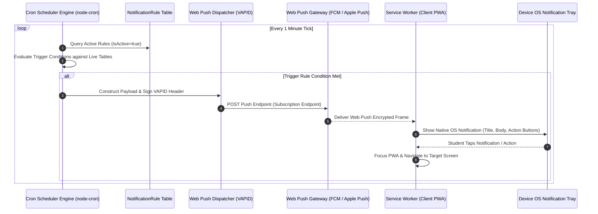
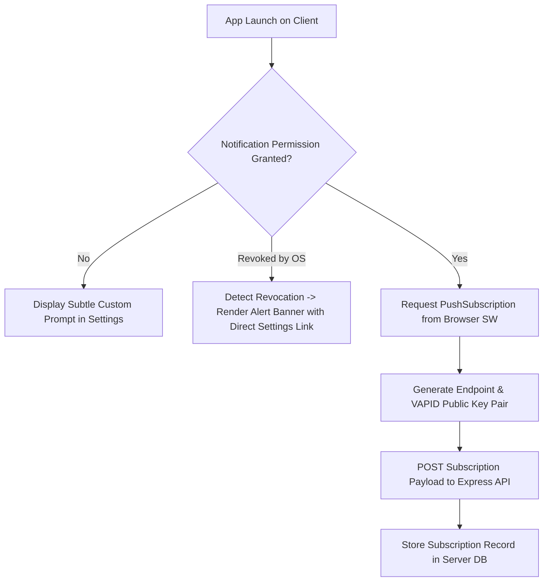

# Notification System Architecture Specification — Student Academic OS

**Document ID:** `12_NOTIFICATION_SYSTEM`  
**Author:** Principal Systems Engineer  
**Status:** Approved / Frozen Under Implementation Freeze  
**Primary References:** [Student_OS_PRD.md §20](file:///c:/Users/vishv/OneDrive/Desktop/Student-Academic-OS/docs/Student_OS_PRD.md#20-notification-engine), [01_PRD_REVIEW.md §Missing Notifications](file:///c:/Users/vishv/OneDrive/Desktop/Student-Academic-OS/docs/01_PRD_REVIEW.md#missing-notifications), [04_USER_FLOWS.md §Flow 13, §Flow 15](file:///c:/Users/vishv/OneDrive/Desktop/Student-Academic-OS/docs/04_USER_FLOWS.md#flow-13-push-notification-pipeline--revocation-recovery), [10_BACKEND_ARCHITECTURE.md §4](file:///c:/Users/vishv/OneDrive/Desktop/Student-Academic-OS/docs/10_BACKEND_ARCHITECTURE.md#4-background-engines-architecture)  
**Target Audience:** Systems Engineers, Backend Developers, Mobile PWA Engineers, AI Implementation Agents  

---

## 1. System Architecture & Notification Lifecycle

The **Notification System** delivers timely, non-intrusive academic alerts (Lecture Reminders, Attendance Risk Warnings, Exam Countdowns, Task Deadlines, and System Downtime Failovers) directly to student devices.



---

## 2. Notification Classification & Priority Hierarchy

Notifications are strictly categorized by priority to prevent notification fatigue and enforce quiet hours:

| Category | Priority | Lead Time / Trigger Condition | Quiet Hours Override? | Target Channel |
| :--- | :--- | :--- | :--- | :--- |
| **Exam Morning Alert** | `CRITICAL` | 07:00 AM on Exam Date | YES (Bypasses Quiet Hours) | Web Push + Sound |
| **Attendance Risk Warning** | `HIGH` | Attendance drops below 75% threshold | NO (Respects Quiet Hours) | Web Push |
| **Exam Pre-Countdown** | `HIGH` | 7 Days prior, 1 Day prior at 08:00 PM | NO | Web Push |
| **Lecture Reminder** | `MEDIUM` | 20 Minutes prior to slot `start_time` | NO | Web Push |
| **Task Due Warning** | `MEDIUM` | 2 Hours prior to task `due_at` | NO | Web Push |
| **Daily Morning Digest** | `LOW` | 08:00 AM Daily | NO | Web Push Summary |
| **VM Downtime Failover** | `EMERGENCY`| Server health check fails for >15 mins | YES | **Email Alert** |

---

## 3. Quiet Hours & Deduplication Engine

### 3.1 Quiet Hours Enforcement Policy
- **Standard Quiet Window:** **11:00 PM to 07:00 AM IST** ([01_PRD_REVIEW.md §Missing Notifications](file:///c:/Users/vishv/OneDrive/Desktop/Student-Academic-OS/docs/01_PRD_REVIEW.md#missing-notifications)).
- **Behavior:** During quiet hours, all `MEDIUM` and `LOW` notifications are deferred and batched into the 08:00 AM Daily Morning Digest.
- **Exception:** `CRITICAL` Exam Morning alerts and `EMERGENCY` VM Downtime emails bypass quiet hours.

### 3.2 Notification Deduplication Strategy
To prevent duplicate alerts when multiple devices are registered:
- Each notification instance generates a deterministic `dedupKey` hash: `MD5(ruleId + entityId + triggerTimestampDate)`.
- The dispatch engine checks a 24-hour Redis/In-Memory deduplication cache. If `dedupKey` exists, dispatch is skipped.

---

## 4. Web Push Architecture & OS Revocation Recovery



### 4.1 Push Payload Schema Specification
```json
{
  "title": "Data Structures — Class in 20 Mins",
  "body": "Room 204 | Prof. Patel. Attendance: 82% (Safe to skip: 2)",
  "icon": "/icons/icon-192x192.png",
  "badge": "/icons/badge-72x72.png",
  "tag": "lecture-reminder-slot-101",
  "data": {
    "targetUrl": "/timetable?slotId=slot-101-uuid",
    "slotId": "slot-101-uuid",
    "action": "MARK_ATTENDANCE"
  },
  "actions": [
    { "action": "mark_present", "title": "Mark Present" },
    { "action": "view_slot", "title": "View Slot" }
  ]
}
```

---

## 5. VM Downtime & Failure Failover Pipeline

As specified in [01_PRD_REVIEW.md §Weakness #3](file:///c:/Users/vishv/OneDrive/Desktop/Student-Academic-OS/docs/01_PRD_REVIEW.md#weaknesses):
- **Problem:** If the Oracle VM crashes, the Node.js Express cron and push engines die with it. Web Push CANNOT alert the user of VM downtime.
- **Solution (External Failover Monitor):** An independent external monitor (UptimeRobot / Cronitor free tier) pings `/api/v1/health` every 5 minutes.
- If the endpoint fails 3 consecutive pings (15 minutes), the external monitor sends an **Email Alert** directly to Vishvraj's personal inbox containing server recovery steps ([04_USER_FLOWS.md §Flow 15](file:///c:/Users/vishv/OneDrive/Desktop/Student-Academic-OS/docs/04_USER_FLOWS.md#flow-15-vm-downtime-detection--email-failover-alerting)).

---

## 6. Architecture Trade-Offs & Rejected Alternatives

| Decision | Chosen Architecture | Rejected Alternative | System Justification |
| :--- | :--- | :--- | :--- |
| **Push Gateway** | Web Push API (VAPID) | OneSignal / Firebase (FCM SDK) | Owning the VAPID pipeline guarantees zero third-party platform lock-in or service shutdown risks over 4 years. |
| **Scheduler Engine** | In-Process `node-cron` | BullMQ / Redis Queue | BullMQ requires a dedicated Redis instance. In-process `node-cron` uses zero additional RAM on Oracle VM free tier. |
| **Downtime Alert** | External Email Failover | Push Notification | Push notifications depend on the affected VM; email failover via external monitor guarantees receipt when VM is down. |
