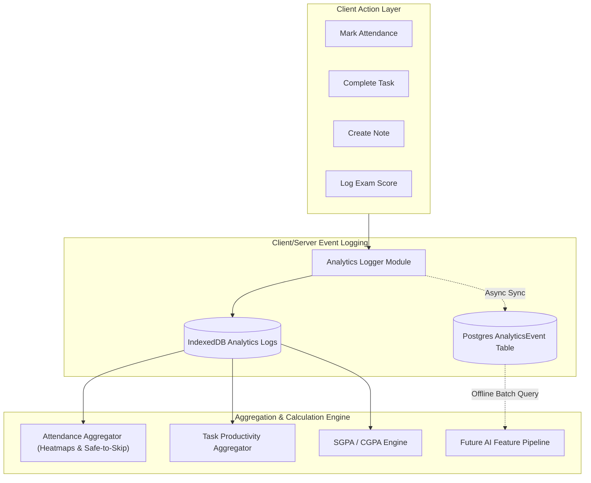

# Analytics System Architecture Specification — Student Academic OS

**Document ID:** `13_ANALYTICS_SYSTEM`  
**Author:** Principal Systems Engineer  
**Status:** Approved / Frozen Under Implementation Freeze  
**Primary References:** [Student_OS_PRD.md §21, §23](file:///c:/Users/vishv/OneDrive/Desktop/Student-Academic-OS/docs/Student_OS_PRD.md#21-analytics-system), [01_PRD_REVIEW.md §Strengths](file:///c:/Users/vishv/OneDrive/Desktop/Student-Academic-OS/docs/01_PRD_REVIEW.md#strengths), [07_DATABASE_ARCHITECTURE.md §3.6](file:///c:/Users/vishv/OneDrive/Desktop/Student-Academic-OS/docs/07_DATABASE_ARCHITECTURE.md#36-entity-analyticsevent)  
**Target Audience:** Systems Engineers, Data Architects, Frontend Analytics Engineers, AI Implementation Agents  

---

## 1. System Architecture & Event Collection Pipeline

The **Analytics System** provides actionable performance insights across four academic domains—Attendance, Tasks, Academic Performance (SGPA/CGPA), and Study Habits—while capturing structured telemetry for future AI models via an append-only event log.



---

## 2. Append-Only Telemetry Schema (`AnalyticsEvent`)

As specified in [Student_OS_PRD.md §23](file:///c:/Users/vishv/OneDrive/Desktop/Student-Academic-OS/docs/Student_OS_PRD.md#23-database-architecture), analytics telemetry uses an **Append-Only Event Store** (`AnalyticsEvent`):

```json
{
  "id": "event-101-uuid",
  "eventType": "ATTENDANCE_MARKED",
  "entityId": "slot-55-uuid",
  "timestamp": "2026-08-04T10:05:00.000Z",
  "meta": {
    "subjectId": "subj-2-uuid",
    "subjectCode": "2AI01",
    "previousStatus": null,
    "newStatus": "present",
    "dayOfWeek": "Tuesday",
    "timeSlot": "09:05-10:00"
  }
}
```

### Supported Event Types:
- `ATTENDANCE_MARKED`, `ATTENDANCE_EDITED`, `SLOT_CANCELLED`, `SLOT_RESCHEDULED`
- `TASK_CREATED`, `TASK_COMPLETED`, `TASK_DELAYED`
- `NOTE_CREATED`, `NOTE_ATTACHMENT_ADDED`
- `EXAM_CHECKLIST_UPDATED`, `SEMESTER_ARCHIVED`

---

## 3. Four-Pillar Domain Analytics Specifications

### 3.1 Pillar 1: Attendance Analytics
- **Per-Subject Trend Line:** Rolling 30-day percentage trend line.
- **Weekday Heatmap:** Matrix rendering attendance percentage grouped by weekday (Monday–Saturday) to surface specific day-of-week absence patterns ([Student_OS_PRD.md §21](file:///c:/Users/vishv/OneDrive/Desktop/Student-Academic-OS/docs/Student_OS_PRD.md#21-analytics-system)).
- **Cancellation Frequency & Faculty Linked Stats:** Tracks cancellation rates grouped by subject and faculty to identify patterns in faculty attendance.

### 3.2 Pillar 2: Task Productivity Analytics
- **Completion Velocity Rate:** Percentage of assigned tasks completed on or before `due_at`.
- **Delay Metric:** Average hours delayed for overdue task completions.
- **Productivity Heatmap:** Daily count of completed tasks and subtasks over a 90-day rolling grid.

### 3.3 Pillar 3: Academic & CGPA Engine
- **Formula Specifications:**
$$\text{SGPA} = \frac{\sum (\text{Course Credits} \times \text{Grade Points})}{\sum \text{Course Credits}}$$

$$\text{CGPA} = \frac{\sum (\text{Semester SGPA} \times \text{Semester Total Credits})}{\sum \text{Total Program Credits}}$$

- **Target-CGPA Solver:** Solves for required SGPA in remaining semesters to achieve a target overall CGPA (e.g. "What SGPA is required in Semesters 5–8 to reach 8.5 CGPA?").

### 3.4 Pillar 4: Study Habits Analytics
- **Note-Taking Proximity:** Ratio of notes created in the 7 days preceding an exam vs standard lecture days.
- **Focus Timer Logs:** Aggregated study block minutes recorded via the integrated Focus Timer.

---

## 4. Aggregation Strategy & Performance Optimization

1. **Client-Side In-Memory Aggregation:** All dashboard analytics charts are computed directly from client IndexedDB tables using lightweight JavaScript reducers, avoiding server API calls.
2. **Semester Scoping:** Analytics queries default to the active semester bounds (`Semester.is_active = true`), keeping calculation time $<15\text{ms}$.
3. **Data Retention Policy:** Telemetry logs are stored permanently (`isDeleted = false`). Analytics logs occupy ~2MB per year, making retention costs across 4 years negligible.

---

## 5. Architecture Trade-Offs & Rejected Alternatives

| System Decision | Chosen Strategy | Rejected Alternative | System Justification |
| :--- | :--- | :--- | :--- |
| **Telemetry Store** | Append-Only JSONB Table | Heavy OLAP (ClickHouse/DuckDB) | A 1-user system generates ~5,000 events/year. Postgres JSONB queries are instant and require zero extra database maintenance. |
| **Chart Calculation** | Client IndexedDB Reducers | Server-Side Heavy Aggregations | Client calculation guarantees analytics load offline in airplane mode. |
