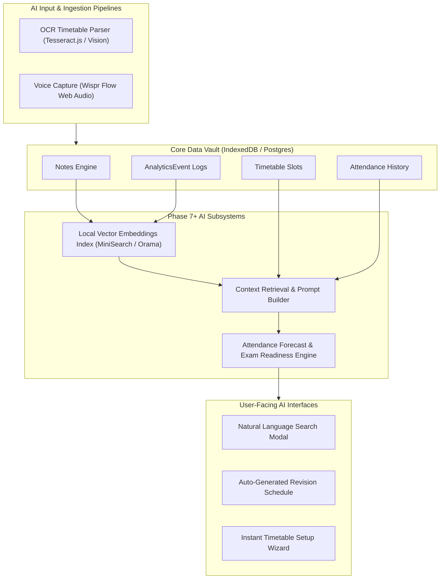

# AI Architecture & Future Roadmap Specification — Student Academic OS

**Document ID:** `14_AI_ARCHITECTURE`  
**Author:** Principal Systems Engineer  
**Status:** Approved / Deferred to Phase 7+ / Frozen Under Implementation Freeze  
**Primary References:** [Student_OS_PRD.md §22](file:///c:/Users/vishv/OneDrive/Desktop/Student-Academic-OS/docs/Student_OS_PRD.md#22-ai-features-future-roadmap-not-phase-16), [01_PRD_REVIEW.md §Missing AI](file:///c:/Users/vishv/OneDrive/Desktop/Student-Academic-OS/docs/01_PRD_REVIEW.md#missing-ai-opportunities), [07_DATABASE_ARCHITECTURE.md §3.6](file:///c:/Users/vishv/OneDrive/Desktop/Student-Academic-OS/docs/07_DATABASE_ARCHITECTURE.md#36-entity-analyticsevent)  
**Target Audience:** AI Systems Architects, ML Engineers, Core Developers, AI Implementation Agents  

---

## 1. AI System Roadmap & Zero-Break Philosophy

As established in [Student_OS_PRD.md §22](file:///c:/Users/vishv/OneDrive/Desktop/Student-Academic-OS/docs/Student_OS_PRD.md#22-ai-features-future-roadmap-not-phase-16), AI capabilities are **deliberately deferred to Phase 7+** (post-MVP). 

To ensure future AI features layer onto the application without requiring database migrations or architectural rewrites, the core database schema has been pre-normalized with **AI-Ready Construct Layers**:
1. **Append-Only Telemetry (`AnalyticsEvent`):** Stores structured user action sequences suitable for pattern mining and model fine-tuning.
2. **Normalized Metadata Fields:** Flexible `JSONB` metadata columns on `Note`, `Task`, `Exam`, and `LectureSlot` tables allow embedding vectors and AI tags to be attached seamlessly.

---

## 2. Master AI Integration Architecture

---

## 3. Vision & Input Pipeline Architecture

### 3.1 Timetable OCR Image Parser Pipeline
- **Problem:** Students must manually re-enter 15–20 weekly timetable slots at the start of every new semester.
- **AI Solution:** Student uploads a photo/PDF of ADIT's printed timetable sheet.
- **Execution Pipeline:**
  1. Client captures photo -> Passes to client-side `Tesseract.js` (or lightweight vision API).
  2. OCR extracts text grid (Days, Time Headers, Room Numbers, Subject Codes).
  3. Structured LLM Parser converts text grid into standardized JSON matching the `LectureSlot` schema ([Student_OS_PRD.md §22](file:///c:/Users/vishv/OneDrive/Desktop/Student-Academic-OS/docs/Student_OS_PRD.md#22-ai-features-future-roadmap-not-phase-16)).
  4. System opens the **JSON Import Conflict Modal** ([04_USER_FLOWS.md §Flow 10](file:///c:/Users/vishv/OneDrive/Desktop/Student-Academic-OS/docs/04_USER_FLOWS.md#flow-10-json-importexport-with-conflict-resolution)), allowing the student to verify slots before committing to IndexedDB.

### 3.2 Voice Quick-Capture Pipeline (Wispr Flow)
- **Integration:** Captures audio snippets during or after class via the Web Audio API.
- **Processing:** Transcribes speech to structured Markdown using Wispr Flow API, automatically extracting subject tags (`#2AI01`) and task due dates.

---

## 4. Algorithmic Prediction & Recommendation Engines

### 4.1 Attendance Forecasting Engine
- **Predictive Model:** Analyzes `AnalyticsEvent` cancellation frequency logs and historical absence heatmaps to forecast attendance trajectory 4 weeks into the future.
- **Anomaly Detection:** Flags sudden spikes in faculty cancellations or personal absences before attendance drops below the 75% threshold ([01_PRD_REVIEW.md §Missing Analytics](file:///c:/Users/vishv/OneDrive/Desktop/Student-Academic-OS/docs/01_PRD_REVIEW.md#missing-analytics)).

### 4.2 Exam Readiness Score & Revision Planner
- **Readiness Formula:**
$$\text{Readiness Score} = 0.4 \times (\text{Syllabus Checklist } \%) + 0.4 \times (\text{Notes Coverage } \%) + 0.2 \times (\text{Days Remaining Weight})$$
- **Revision Schedule Generator:** Merges Exam Readiness Scores with timetable gaps identified by the **Free-Time Finder** to auto-generate structured study blocks.

---

## 5. Local Vector Embeddings & Privacy Controls

1. **Privacy-First Guarantee:** Personal academic data (notes, attendance, transcripts) NEVER trains public AI models.
2. **Local Vector Search:** Semantic search over Markdown notes utilizes local browser-side embeddings (Transformers.js / WebGPU) indexed inside MiniSearch/Orama.
3. **Zero-Cost Baseline:** All OCR and vector search tasks execute on-device at **$0.00 operational cost**.
