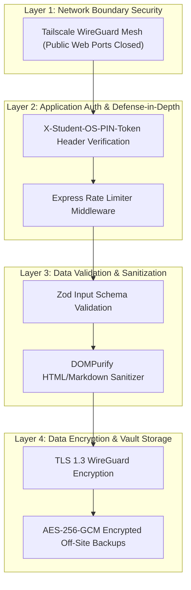

# Security Architecture Specification — Student Academic OS

**Document ID:** `15_SECURITY_ARCHITECTURE`  
**Author:** Principal Systems Engineer  
**Status:** Approved / Frozen Under Implementation Freeze  
**Primary References:** [Student_OS_PRD.md §24](file:///c:/Users/vishv/OneDrive/Desktop/Student-Academic-OS/docs/Student_OS_PRD.md#24-api-design), [01_PRD_REVIEW.md §Security Concerns](file:///c:/Users/vishv/OneDrive/Desktop/Student-Academic-OS/docs/01_PRD_REVIEW.md#security-concerns), [06_SYSTEM_ARCHITECTURE.md §5](file:///c:/Users/vishv/OneDrive/Desktop/Student-Academic-OS/docs/06_SYSTEM_ARCHITECTURE.md#5-security--network-boundary-architecture)  
**Target Audience:** Security Engineers, Systems Engineers, Core Developers, AI Implementation Agents  

---

## 1. Security Architecture & Threat Model (STRIDE)

**Student Academic OS** enforces a multi-layered **Defense-in-Depth Security Stance**. Because the application handles private academic history, attendance audit logs, and notes, the architecture prioritizes **Network Mesh Isolation**, **Strict Input Validation**, and **Zero Public Attack Surface** ([01_PRD_REVIEW.md §Security Concerns](file:///c:/Users/vishv/OneDrive/Desktop/Student-Academic-OS/docs/01_PRD_REVIEW.md#security-concerns)).



---

## 2. STRIDE Threat Analysis Matrix

| Threat Category | Potential Attack Vector | System Defense Mechanism | System Impact |
| :--- | :--- | :--- | :--- |
| **Spoofing** | Unauthorized device connecting to backend API | Tailscale WireGuard node authorization + PIN Session Token header | **MITIGATED** (Unauthenticated devices cannot reach API) |
| **Tampering** | Man-in-the-middle payload modification | TLS 1.3 encryption over Tailscale mesh network | **MITIGATED** |
| **Repudiation** | Denying attendance edit actions | Inlined `AttendanceRecord.editHistory` JSON audit trail | **MITIGATED** ([07_DATABASE_ARCHITECTURE.md §3.4](file:///c:/Users/vishv/OneDrive/Desktop/Student-Academic-OS/docs/07_DATABASE_ARCHITECTURE.md#34-entity-attendancerecord)) |
| **Information Disclosure** | Public automated vulnerability scanning | UFW firewall drops all public HTTP/S traffic (ports 80, 443, 4000 closed) | **MITIGATED** ([06_SYSTEM_ARCHITECTURE.md §5](file:///c:/Users/vishv/OneDrive/Desktop/Student-Academic-OS/docs/06_SYSTEM_ARCHITECTURE.md#5-security--network-boundary-architecture)) |
| **Denial of Service** | API flooding / script spamming | Express rate limiter (`100 req/min` per Tailscale IP) | **MITIGATED** |
| **Elevation of Privilege**| SQL Injection / XSS in Markdown notes | Kysely parameterized SQL queries + DOMPurify rendering | **MITIGATED** |

---

## 3. Cryptographic & Secret Management Standards

### 3.1 Encryption Standards
- **Data in Transit:** Encrypted via WireGuard (ChaCha20-Poly1305) over Tailscale + TLS 1.3.
- **Data at Rest (Off-Site Backups):** Nightly JSON exports encrypted with **AES-256-GCM** before pushing to private GitHub repository ([06_SYSTEM_ARCHITECTURE.md §6](file:///c:/Users/vishv/OneDrive/Desktop/Student-Academic-OS/docs/06_SYSTEM_ARCHITECTURE.md#6-resilience--monitoring-strategy)).
- **PIN Token Storage:** User PIN hashed on backend using **Argon2id** / **bcrypt** (`cost factor = 12`).

### 3.2 Secret Management Strategy
- Application secrets (`DATABASE_URL`, `TAILSCALE_AUTH_KEY`, `VAPID_PRIVATE_KEY`, `PIN_HASH`) are injected strictly via systemd environment variable files (`/etc/student-os/env`).
- No secrets or API credentials are ever committed to git repositories.

---

## 4. OWASP Web Security Controls

1. **XSS Mitigation:** Markdown rendering uses `DOMPurify` to sanitize HTML elements prior to injection into the DOM.
2. **SQL Injection Defense:** All Postgres queries execute via Kysely parameterized SQL bindings. Raw SQL string concatenation is strictly forbidden.
3. **CORS Policy:** Locked to local application origins (`http://localhost:5173`, `app://student-os`).
4. **Content Security Policy (CSP):**
```http
Content-Security-Policy: default-src 'self'; script-src 'self'; style-src 'self' 'unsafe-inline'; img-src 'self' data: blob: https://*; connect-src 'self' http://100.64.0.1:4000;
```

---

## 5. Offline & Client Device Security

- **IndexedDB Isolation:** Browser IndexedDB data is isolated per origin sandbox enforced by browser Same-Origin Policy (SOP).
- **Physical Device Lock:** On mobile/desktop devices, opening the PWA requires device biometric/passcode authentication if configured.
