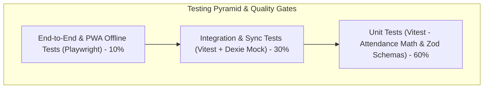
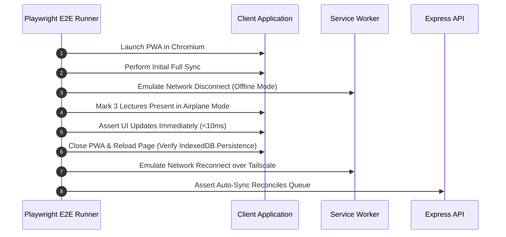

# Testing Strategy Specification — Student Academic OS

**Document ID:** `16_TESTING_STRATEGY`  
**Author:** Principal Systems Engineer  
**Status:** Approved / Frozen Under Implementation Freeze  
**Primary References:** [Student_OS_PRD.md §14, §29](file:///c:/Users/vishv/OneDrive/Desktop/Student-Academic-OS/docs/Student_OS_PRD.md), [01_PRD_REVIEW.md §Risks](file:///c:/Users/vishv/OneDrive/Desktop/Student-Academic-OS/docs/01_PRD_REVIEW.md#risks), [04_USER_FLOWS.md](file:///c:/Users/vishv/OneDrive/Desktop/Student-Academic-OS/docs/04_USER_FLOWS.md), [07_DATABASE_ARCHITECTURE.md](file:///c:/Users/vishv/OneDrive/Desktop/Student-Academic-OS/docs/07_DATABASE_ARCHITECTURE.md)  
**Target Audience:** QA Engineers, Systems Engineers, Core Developers, AI Implementation Agents  

---

## 1. Testing Philosophy & Test Pyramid

As identified in [01_PRD_REVIEW.md §Risks](file:///c:/Users/vishv/OneDrive/Desktop/Student-Academic-OS/docs/01_PRD_REVIEW.md#risks), Student Academic OS is built by a single engineer and maintained over four years. Because a calculation bug during mid-semester exam week is the worst-case failure, the testing strategy prioritizes **Automated Verification of Critical Logic** (Attendance Math, Safe-to-Skip Formula, Offline Storage, Sync Reconciliation).



---

## 2. Unit Testing Strategy (`Vitest`)

### Target Modules & Test Coverage:
- **Attendance Formula Engine (`calculateSafeToSkip`):**
  - Verify 5-state calculation (`Attended / (Scheduled - Cancelled)`).
  - Verify cancelled lectures are auto-excluded from denominator.
  - Verify medical/on-duty marks contribute correctly.
  - Edge Case Test: $0$ scheduled lectures, $100\%$ cancelled lectures, boundary at exactly $74.9\%$ vs $75.0\%$.
- **Date & Timetable Calculations:**
  - Verify future attendance marking blocks (`date > today` raises validation error).
  - Verify slot end time precede start time validation.
- **SGPA / CGPA Engine:** Verify weighted credit math against CVM University formulas.

---

## 3. Integration & Sync Testing Strategy

- **IndexedDB Transaction Tests (`fake-indexeddb`):**
  - Verify atomic bulk write operations.
  - Verify soft-delete flags (`isDeleted = true`) exclude rows from active queries.
- **Sync Reconciliation Queue Tests:**
  - Simulate 2-device edit collision on `AttendanceRecord`.
  - Assert backend returns HTTP 409 and writes entry to `SyncConflictLog`.
  - Verify conflict resolution picker correctly updates both client and server tables.

---

## 4. End-to-End & Offline PWA Testing (`Playwright`)



---

## 5. Definition of Done (DoD) Checklist

Before any code module or feature branch is merged into `main`:

```
DEFINITION OF DONE (DoD) CHECKLIST
[ ] 1. All Vitest unit tests pass with >90% code coverage on core domain logic.
[ ] 2. Attendance math formulas verified against CVM 75% edge-case suite.
[ ] 3. Offline storage verified using simulated network disconnects.
[ ] 4. Zero hard DELETE SQL queries or Dexie .delete() calls exist in codebase.
[ ] 5. Zod schema validation enforced on all incoming API routes.
[ ] 6. Responsive UI layout verified on 360px mobile viewport and 1920px desktop view.
[ ] 7. WAI-ARIA accessibility check passes with zero contrast or keyboard focus errors.
```
