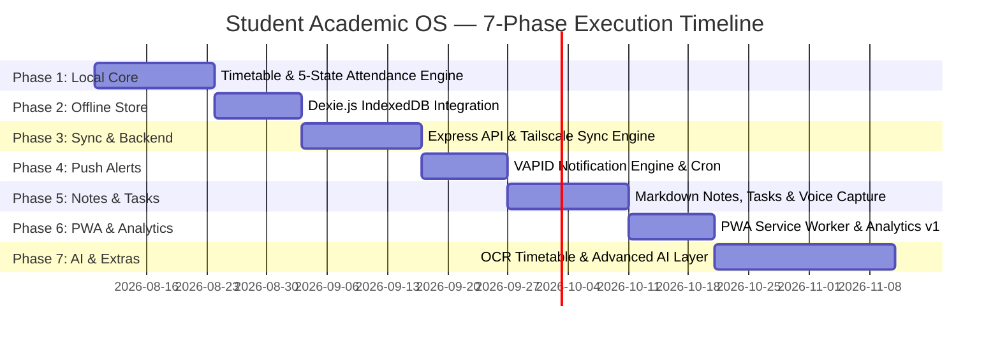
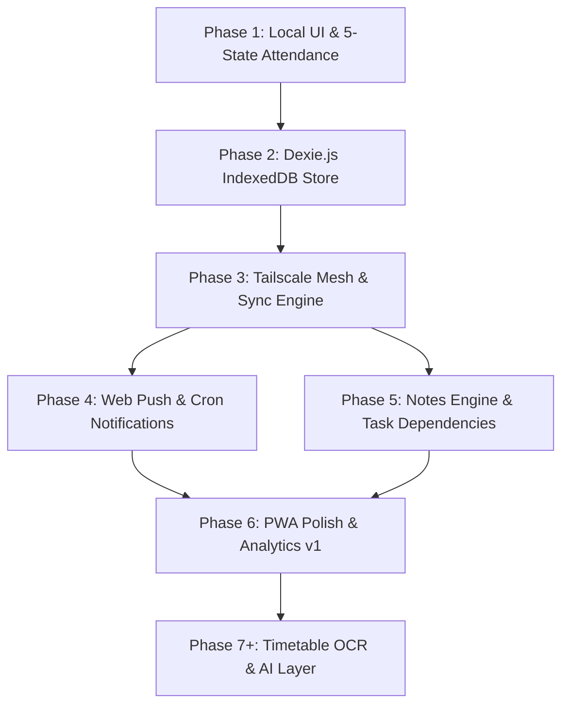

# Project Implementation Roadmap — Student Academic OS

**Document ID:** `18_ROADMAP`  
**Author:** Engineering Director  
**Status:** Approved / Ready for Execution  
**Primary References:** [Student_OS_PRD.md §29](file:///c:/Users/vishv/OneDrive/Desktop/Student-Academic-OS/docs/Student_OS_PRD.md#29-phase-wise-development-plan), [00_PROJECT_OVERVIEW.md](file:///c:/Users/vishv/OneDrive/Desktop/Student-Academic-OS/docs/00_PROJECT_OVERVIEW.md), [06_SYSTEM_ARCHITECTURE.md](file:///c:/Users/vishv/OneDrive/Desktop/Student-Academic-OS/docs/06_SYSTEM_ARCHITECTURE.md), [17_DEPLOYMENT.md](file:///c:/Users/vishv/OneDrive/Desktop/Student-Academic-OS/docs/17_DEPLOYMENT.md)  
**Target Audience:** Engineering Leadership, Project Managers, Core Developers, AI Implementation Agents  

---

## 1. Project Vision & Phased Release Strategy

**Student Academic OS** is structured into **seven sequential development phases** designed to deliver immediate personal utility on Day 1 while systematically expanding into a resilient, offline-first multi-device system across a 4-year academic timeline (2025–2029).

---

## 2. Milestone Phase Breakdown

### Phase 1: Core Local MVP (Usable Day One)
- **Objective:** Render ADIT timetable structure, mark per-lecture attendance (5 states), and compute live % + Safe-to-Skip math ([Student_OS_PRD.md §29](file:///c:/Users/vishv/OneDrive/Desktop/Student-Academic-OS/docs/Student_OS_PRD.md#29-phase-wise-development-plan)).
- **Key Deliverables:** React SPA shell, Timetable weekly view, 5-state Attendance modal, Quiet Dashboard layout.
- **Dependency:** None.

### Phase 2: Offline Persistence Layer
- **Objective:** Wire client IndexedDB via Dexie.js to ensure data survives page refreshes and browser restarts offline.
- **Key Deliverables:** Dexie.js database instance, reactive `useLiveQuery` integration, soft-delete rules.

### Phase 3: Backend REST API & Tailscale Sync
- **Objective:** Deploy Node/Express server on Oracle VM, establish Tailscale mesh boundary, and implement two-device sync with conflict resolution queues.
- **Key Deliverables:** Tailscale network setup, Neon Postgres schema migrations, REST API endpoints (`/api/v1/sync/reconcile`), 2-device conflict queue UI.

### Phase 4: Web Push Notification Engine
- **Objective:** Deploy background `node-cron` daemon and Web Push (VAPID) alerting pipeline.
- **Key Deliverables:** 20-min pre-class notifications, attendance risk alerts (<75%), exam countdown triggers, email failover on VM downtime.

### Phase 5: Notes Engine, Tasks & Voice Capture
- **Objective:** Build Markdown note taking, task dependency management, and Wispr Flow voice capture integration.
- **Key Deliverables:** Markdown editor, MiniSearch full-text index, task subtask drawers, voice capture FAB.

### Phase 6: PWA Polish, Analytics v1 & Off-Site Backup
- **Objective:** Implement service worker caching, installable PWA manifest, Attendance analytics charts, and nightly encrypted GitHub backups.
- **Key Deliverables:** Service worker manifest, Analytics tab, automated GitHub export script.

### Phase 7+: Advanced Features & AI Layer (Post-MVP)
- **Objective:** Layer Phase 7+ AI features (Timetable OCR parser, natural language search, revision planner) without schema changes.

---

## 3. Critical Path & Dependencies

---

## 4. Release Checklist & Versioning Philosophy

The project adheres to **Semantic Versioning (SemVer 2.0.0)**:
- `v1.0.0`: Phases 1–3 Complete (Usable single-user app with offline storage and server sync).
- `v1.5.0`: Phases 4–6 Complete (Notifications, Notes, Tasks, Analytics & Off-site backup active).
- `v2.0.0`: Phase 7+ Complete (AI features, OCR parser, advanced directory).
