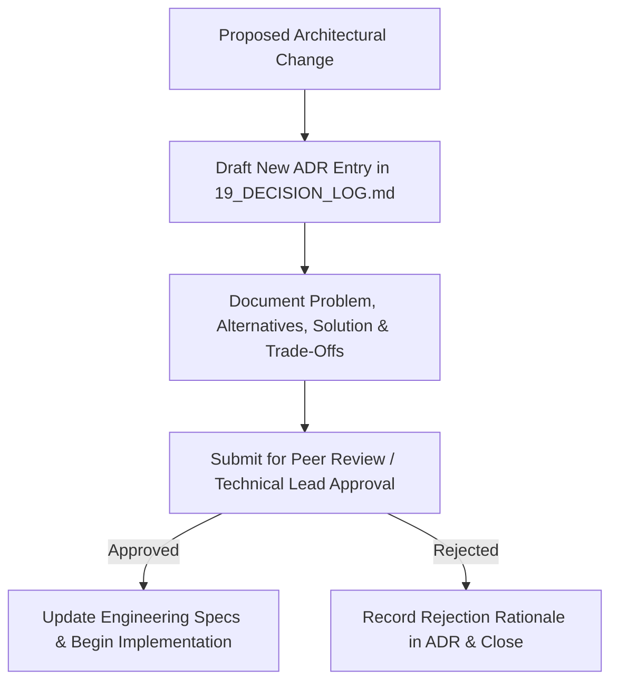

# Engineering Governance & Collaboration Policy — Student Academic OS

**Document ID:** `23_PROJECT_GOVERNANCE`  
**Author:** Engineering Director  
**Status:** Approved / Active Governance Standard  
**Primary References:** [00_DOCUMENTATION_GUIDE.md](file:///c:/Users/vishv/OneDrive/Desktop/Student-Academic-OS/docs/00_DOCUMENTATION_GUIDE.md), [16_TESTING_STRATEGY.md §5](file:///c:/Users/vishv/OneDrive/Desktop/Student-Academic-OS/docs/16_TESTING_STRATEGY.md#5-definition-of-done-dod-checklist), [19_DECISION_LOG.md](file:///c:/Users/vishv/OneDrive/Desktop/Student-Academic-OS/docs/19_DECISION_LOG.md)  
**Target Audience:** Core Developers, Code Reviewers, DevOps Engineers, AI Implementation Agents  

---

## 1. Repository Standards & Branching Model

Student Academic OS follows a **Trunk-Based Development Model with Short-Lived Feature Branches**:

```
main (Production Ready Stable Branch)
 ├── feature/task-101-weekly-grid
 ├── feature/task-102-attendance-math
 └── fix/task-302-sync-conflict-bug
```

### Branch Naming Conventions:
- **Feature Branches:** `feature/task-<ID>-<short-description>` (e.g. `feature/task-101-weekly-grid`).
- **Bug Fix Branches:** `fix/task-<ID>-<short-description>` (e.g. `fix/task-302-sync-conflict-bug`).
- **Documentation Branches:** `docs/<short-description>` (e.g. `docs/update-api-spec`).

---

## 2. Commit Message Standards (Conventional Commits)

All commit messages MUST adhere to the **Conventional Commits v1.0.0** specification:

```
<type>(<scope>): <short description in imperative present tense>

[optional body explaining WHY changes were made]

[optional footer referencing task ID]
```

### Allowed Types:
- `feat`: A new user-facing feature.
- `fix`: A bug fix in existing code.
- `docs`: Documentation updates only.
- `test`: Adding missing tests or refactoring existing test suites.
- `refactor`: Code changes that neither fix a bug nor add a feature.
- `chore`: Maintenance tasks, build system, or dependency updates.

### Examples:
- `feat(attendance): implement 5-state calculation engine with safe-to-skip math (#TASK-102)`
- `fix(sync): resolve edge-case collision handling on AttendanceRecord (#TASK-302)`

---

## 3. Engineering Quality Gates (DoR & DoD)

### 3.1 Definition of Ready (DoR)
A task from `22_IMPLEMENTATION_BACKLOG.md` is considered **Ready for Development** only if:
1. User story, business value, and technical description are explicitly defined.
2. Dependencies are met and merged into `main`.
3. Target database entities, API endpoints, and UI modules are referenced.
4. Acceptance criteria and test scenarios are documented.

### 3.2 Definition of Done (DoD)
A feature branch is considered **Done** and eligible for merge into `main` only if:
1. All Acceptance Criteria specified in the backlog entry are satisfied.
2. Vitest unit tests pass with >90% code coverage on core domain logic.
3. Zero hard `DELETE` SQL queries or Dexie calls are introduced (`isDeleted` soft-delete enforced).
4. Tailscale security boundary and Zod schema validation are verified.
5. Responsive layout verified on 360px mobile viewport and desktop viewport.
6. Documentation updated if API parameters or data schemas changed.

---

## 4. Architecture Change Control Process (ADR Requirement)

No engineer or AI implementation agent may alter core system architecture, data models, or security boundaries without executing the **Architecture Decision Process**:



---

## 5. AI Agent Collaboration Rules & Execution Guardrails

Future AI coding agents operating on this repository MUST strictly follow these governance guardrails:

1. **Read Before Editing:** AI agents MUST inspect `00_DOCUMENTATION_GUIDE.md`, `Student_OS_PRD.md`, `06_SYSTEM_ARCHITECTURE.md`, and the specific task entry in `22_IMPLEMENTATION_BACKLOG.md` before generating code.
2. **Offline-First Non-Negotiable:** Never introduce cloud-only dependencies that break offline execution.
3. **Soft-Delete Mandatory:** Never issue `DELETE` SQL queries or Dexie `.delete()` calls on domain entities.
4. **Tailscale Network Isolation:** Backend endpoints MUST NOT be exposed directly to the public internet without Tailscale mesh authentication.
5. **Quiet Dashboard Rule:** Never render warning alerts or banners on the UI unless a threshold condition is explicitly breached (e.g. attendance < 75%).
6. **No Placeholder Code:** In implementation phases, placeholder comments (e.g. `// TODO: implement later`) in core logic (attendance math, sync reconciliation, soft delete) are forbidden.
