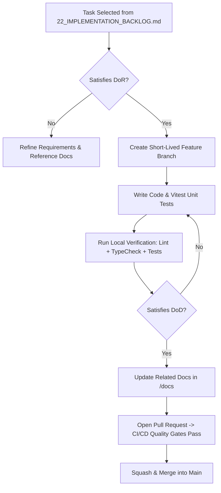

# Engineering Constitution & Implementation Charter — Student Academic OS

**Document ID:** `IMPLEMENTATION_CHARTER`  
**Author:** Chief Technology Officer (CTO) & Engineering Director  
**Status:** Approved / Immutable Engineering Constitution  
**Primary References:** [Student_OS_PRD.md](file:///c:/Users/vishv/OneDrive/Desktop/Student-Academic-OS/docs/Student_OS_PRD.md), [01_PRD_REVIEW.md](file:///c:/Users/vishv/OneDrive/Desktop/Student-Academic-OS/docs/01_PRD_REVIEW.md), [06_SYSTEM_ARCHITECTURE.md](file:///c:/Users/vishv/OneDrive/Desktop/Student-Academic-OS/docs/06_SYSTEM_ARCHITECTURE.md), [23_PROJECT_GOVERNANCE.md](file:///c:/Users/vishv/OneDrive/Desktop/Student-Academic-OS/docs/23_PROJECT_GOVERNANCE.md)  
**Target Audience:** Core Engineering Team, Technical Leads, AI Implementation Agents, Future Maintainers  

---

## Preamble: Authority of the Charter

This **Implementation Charter** serves as the supreme engineering constitution for **Student Academic OS**. It establishes the non-negotiable architectural standards, coding rules, quality gates, and AI execution guardrails for all code produced across the 4-year project lifecycle (2025–2029).

This document is the **highest priority engineering authority** in the repository, superseded only by the immutable product requirements in [Student_OS_PRD.md](file:///c:/Users/vishv/OneDrive/Desktop/Student-Academic-OS/docs/Student_OS_PRD.md).

```
┌─────────────────────────────────────────────────────────────────────────────────┐
│                          AUTHORITY HIERARCHY MAP                                │
│ 1. Student_OS_PRD.md (Immutable Product Scope & Business Intent)                 │
│ 2. IMPLEMENTATION_CHARTER.md (This Constitution — Technical Rules & Guardrails)  │
│ 3. 01_PRD_REVIEW.md & 19_DECISION_LOG.md (Architecture & Risk Amendments)       │
│ 4. Engineering Specifications (06_SYSTEM, 07_DATABASE, 08_API, 09_FRONTEND...) │
│ 5. Source Code & Unit Tests (Future Implementation Phase)                       │
└─────────────────────────────────────────────────────────────────────────────────┘
```

> **SUPREMACY CLAUSE:** If any implemented source code or pull request conflicts with this Charter, **the code MUST be refactored to comply with the Charter**. The Charter does not yield to convenience or premature shortcuts.

---

## 1. Engineering Philosophy

### 1.1 Core Principles
- **Offline-First Baseline:** The application treats the network as an asynchronous enhancement, not a dependency. All user reads and writes MUST execute locally in IndexedDB first ($<10\text{ms}$ rendering).
- **Simplicity Over Cleverness:** Prefer simple, readable, explicit code over complex abstractions or premature optimizations. 
- **Soft-Delete Everywhere:** No data row is ever hard-deleted from the database. All entities include `isDeleted: boolean` and `deletedAt: timestamp`.
- **Zero-Cost Operation:** Infrastructure is bounded by non-expiring free tiers (Oracle Cloud Always Free VM, Neon Serverless Postgres, Cloudflare Pages/R2, GitHub Student Pack).
- **Quiet Dashboard Aesthetics:** Visual alerts and warning banners render **only when a threshold condition is breached** (e.g. attendance < 75%). An always-green UI stays silent.

---

## 2. Definition of Ready (DoR)

No engineering task or user story from [22_IMPLEMENTATION_BACKLOG.md](file:///c:/Users/vishv/OneDrive/Desktop/Student-Academic-OS/docs/22_IMPLEMENTATION_BACKLOG.md) may enter a sprint or begin development until all DoR criteria are satisfied:

```
DEFINITION OF READY (DoR) CHECKLIST
[ ] 1. Feature requirement traces back to Student_OS_PRD.md.
[ ] 2. Clear user story and business value defined.
[ ] 3. Explicit Acceptance Criteria documented.
[ ] 4. All task dependencies merged into main branch.
[ ] 5. Target database entities, REST APIs, and UI components referenced.
[ ] 6. Test strategy and Definition of Done identified.
```

---

## 3. Definition of Done (DoD)

A pull request or feature branch is considered **Done** and eligible for merge into `main` only when all DoD criteria pass:

```
DEFINITION OF DONE (DoD) CHECKLIST
[ ] 1. Implementation satisfies 100% of Acceptance Criteria.
[ ] 2. Vitest unit tests pass with >90% code coverage on core domain logic.
[ ] 3. Playwright offline PWA tests pass in airplane mode.
[ ] 4. TypeScript strict mode compilation succeeds with ZERO errors.
[ ] 5. ESLint and Prettier pass with ZERO warnings or errors.
[ ] 6. Zero console.log, console.warn, or debug statements remain.
[ ] 7. Soft-delete policy enforced (zero hard DELETE queries or Dexie .delete() calls).
[ ] 8. WAI-ARIA accessibility guidelines pass (zero contrast or focus trap errors).
[ ] 9. Documentation updated if APIs, data models, or UX flows were modified.
```

---

## 4. Repository Structure & Module Rules

### 4.1 Folder Conventions
- Frontend source code resides strictly inside `src/`.
- Backend source code resides strictly inside `server/src/`.
- All markdown documentation resides strictly inside `/docs/`.

### 4.2 Module Boundaries & Import Rules
- **No Circular Dependencies:** Circular imports between components, hooks, or repositories are strictly forbidden. Enforced via ESLint `import/no-circular-dependencies`.
- **Strict Layering:** Components -> Hooks -> Services -> Repositories -> Database. Components MUST NOT bypass hooks/services to invoke database drivers directly.
- **Maximum File Sizes:**
  - UI Component Files: Max **250 lines**.
  - Custom Hooks: Max **150 lines**.
  - Service / Backend Handlers: Max **300 lines**.

---

## 5. Coding Standards

### 5.1 TypeScript Standards
- **Strict Mode Mandatory:** `"strict": true` enforced in `tsconfig.json`.
- **No Implicit `any`:** `any` types are strictly forbidden. Use explicit types, generics, or `unknown` with type guards.
- **Explicit Return Types:** All exported functions MUST declare explicit return types.

### 5.2 React & State Management Standards
- **Functional Components Only:** Class components are forbidden.
- **Data Subscriptions:** React components MUST subscribe to IndexedDB via Dexie `useLiveQuery()`. Direct HTTP API calls inside `useEffect()` on initial render are forbidden.
- **State Separation:** Persistent domain data resides in IndexedDB (Dexie.js). Transient UI session state (e.g. open modal IDs, active tabs) resides in Zustand.

### 5.3 Validation & Error Handling
- **Runtime Validation:** All API request bodies and external JSON inputs MUST be validated using **Zod schemas**.
- **Error Sanitization:** API error responses MUST NOT leak database stack traces to the client.

---

## 6. Testing Standards

- **Unit Tests (`Vitest`):** Mandatory for all math calculations (`calculateSafeToSkip`, attendance percentages, SGPA/CGPA solvers, Zod schemas).
- **Integration Tests:** Mandatory for Dexie.js offline reads/writes and background sync reconciliation queues.
- **E2E Tests (`Playwright`):** Mandatory for verifying PWA app launch, offline airplane mode operation, and responsive bottom bar navigation.

---

## 7. Documentation Synchronization Policy

Every code change that impacts APIs, database schemas, user flows, or architectural boundaries **MUST update the corresponding markdown documentation inside `/docs/` in the SAME pull request**. Code merges with outdated documentation are strictly blocked.

---

## 8. Git & Branching Policy

- **Branch Model:** Trunk-based development using short-lived feature branches (`feature/task-<ID>-description`, `fix/task-<ID>-description`).
- **Commit Messages:** MUST follow **Conventional Commits v1.0.0** (`feat:`, `fix:`, `docs:`, `test:`, `refactor:`, `chore:`).
- **Merge Strategy:** Squash and merge into `main`. Direct pushes to `main` are disabled.

---

## 9. Quality Gates (CI/CD Pipeline Rules)

The GitHub Actions CI/CD pipeline will automatically reject any Pull Request if:
1. Vitest or Playwright tests fail.
2. TypeScript compiler returns any type error.
3. ESLint or Prettier checks fail.
4. Code coverage drops below 90% on core math modules.
5. Soft-delete rule scanner detects a hard `DELETE` query or `.delete()` call.

---

## 10. AI Development Rules & Guardrails

All future AI coding agents (and human developers) operating on this repository MUST obey the following guardrails:

```
┌─────────────────────────────────────────────────────────────────────────────────┐
│                         AI AGENT EXECUTION GUARDRAILS                           │
│ 1. NEVER invent new product requirements not present in Student_OS_PRD.md.     │
│ 2. NEVER alter database schemas or APIs without an approved ADR.                │
│ 3. NEVER introduce cloud-only dependencies that break offline execution.        │
│ 4. NEVER write hard SQL DELETE queries or Dexie .delete() calls.                │
│ 5. NEVER render warning banners unless attendance falls below 75% threshold.    │
│ 6. NEVER leave placeholder comments (e.g. "// TODO: implement later").          │
│ 7. ALWAYS write Vitest unit tests for new business logic functions.            │
│ 8. ALWAYS update related documentation in /docs in the same pull request.       │
└─────────────────────────────────────────────────────────────────────────────────┘
```

---

## 11. Architecture Protection & Decision Log Process

- **Protected Documents:** `Student_OS_PRD.md`, `01_PRD_REVIEW.md`, `IMPLEMENTATION_CHARTER.md`. These files are immutable and cannot be rewritten or deleted.
- **ADR Mandate:** Architectural changes MUST be recorded as a new Architecture Decision Record in [19_DECISION_LOG.md](file:///c:/Users/vishv/OneDrive/Desktop/Student-Academic-OS/docs/19_DECISION_LOG.md) and approved before code changes begin.

---

## 12. End-to-End Implementation Workflow



---

## 13. Future Maintenance & Technical Debt Rules

- **Yearly Dependency Checkpoint:** Conducted annually in June to review and update non-breaking security patches without breaking mid-semester stability.
- **Technical Debt Tracking:** Technical debt items MUST be cataloged as backlog tasks with priority ratings. Undocumented technical debt is forbidden.
